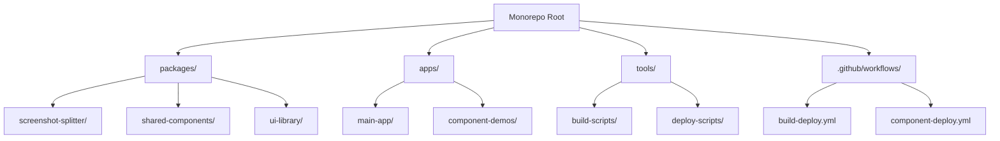

# 双模式构建Monorepo系统设计文档

## 概述

本设计文档描述了一个支持双模式输出（单文件HTML + SPA多文件）的自动化部署系统，并使用pnpm + monorepo重构项目为组件化架构。系统基于Vite构建工具，确保长截图分割工具等组件可以独立部署和使用。

### 核心目标
- 实现双模式构建系统（单文件HTML + SPA多文件）
- 自动化GitHub Pages部署，支持独立组件部署
- 使用pnpm + monorepo架构重构项目
- 确保组件解耦和独立使用能力

## 架构设计

### 整体架构



### 项目结构

```
dual-build-monorepo-system/
├── package.json                 # 根package.json，配置workspace
├── pnpm-workspace.yaml         # pnpm workspace配置
├── vite.config.base.js         # 基础vite配置
├── .github/
│   └── workflows/
│       ├── build-deploy.yml    # 主应用部署
│       └── component-deploy.yml # 独立组件部署
├── packages/                   # 共享包
│   ├── screenshot-splitter/    # 长截图分割工具
│   │   ├── package.json
│   │   ├── vite.config.js     # 组件专用配置
│   │   ├── index.html         # 独立页面入口
│   │   └── src/
│   ├── shared-components/      # 共享组件库
│   └── ui-library/            # 统一UI组件库
├── apps/                      # 应用
│   ├── main-app/             # 主应用
│   │   ├── package.json
│   │   ├── vite.config.js
│   │   └── src/
│   └── component-demos/       # 组件演示应用
└── tools/                     # 构建工具
    ├── build-scripts/
    └── deploy-scripts/
```

## 组件和接口设计

### 1. 双模式构建系统

#### 构建配置接口
```typescript
interface BuildConfig {
  mode: 'singlefile' | 'spa';
  target: string;
  outDir: string;
  base: string;
  plugins: Plugin[];
}

interface SingleFileConfig extends BuildConfig {
  inlineAssets: boolean;
  removeViteModuleLoader: boolean;
  externalLibs: Record<string, string>;
}
```

#### Vite配置结构
```javascript
// vite.config.base.js - 基础配置
export const createBaseConfig = (options) => {
  const { mode, component } = options;
  const isSingle = mode === 'singlefile';
  
  return {
    base: './',
    plugins: [
      react(),
      ...(isSingle ? [
        viteSingleFile({
          removeViteModuleLoader: true,
          useRecommendedBuildConfig: true
        }),
        viteExternalsPlugin({
          react: 'React',
          'react-dom': 'ReactDOM'
        })
      ] : [])
    ],
    build: {
      ...(isSingle && {
        cssCodeSplit: false,
        assetsInlineLimit: Number.MAX_SAFE_INTEGER,
        rollupOptions: {
          inlineDynamicImports: true,
          output: {
            manualChunks: () => 'everything.js'
          }
        }
      })
    }
  };
};
```

### 2. 组件独立部署系统

#### 组件路由配置
```typescript
interface ComponentRoute {
  path: string;
  component: string;
  standalone: boolean;
  buildModes: ('singlefile' | 'spa')[];
}

const componentRoutes: ComponentRoute[] = [
  {
    path: '/screenshot-splitter',
    component: 'screenshot-splitter',
    standalone: true,
    buildModes: ['singlefile', 'spa']
  }
];
```

#### 独立组件构建接口
```typescript
interface StandaloneComponent {
  name: string;
  entry: string;
  outputPath: string;
  dependencies: string[];
  buildConfig: BuildConfig;
}
```

### 3. Monorepo包管理

#### Workspace配置
```yaml
# pnpm-workspace.yaml
packages:
  - 'packages/*'
  - 'apps/*'
  - 'tools/*'
```

#### 包依赖关系
```typescript
interface PackageDependency {
  name: string;
  version: string;
  type: 'dependencies' | 'devDependencies' | 'peerDependencies';
  workspace?: boolean;
}
```

## 数据模型

### 构建配置模型
```typescript
interface BuildTarget {
  name: string;
  mode: 'singlefile' | 'spa';
  component?: string;
  outputDir: string;
  publicPath: string;
  env: Record<string, string>;
}

interface DeploymentConfig {
  targets: BuildTarget[];
  githubPages: {
    branch: string;
    directory: string;
    customDomain?: string;
  };
  components: ComponentDeployment[];
}

interface ComponentDeployment {
  name: string;
  path: string;
  buildTargets: BuildTarget[];
  dependencies: string[];
}
```

### 组件元数据模型
```typescript
interface ComponentMetadata {
  name: string;
  version: string;
  description: string;
  entry: string;
  standalone: boolean;
  routes: string[];
  dependencies: PackageDependency[];
  buildOutputs: {
    singlefile?: string;
    spa?: string;
  };
}
```

## 错误处理

### 构建错误处理
1. **配置验证错误**
   - 验证vite配置的完整性
   - 检查必要插件的安装状态
   - 验证环境变量配置

2. **依赖解析错误**
   - 检查workspace依赖的正确性
   - 验证外部CDN库的可用性
   - 处理循环依赖问题

3. **构建失败处理**
   - 提供详细的错误日志
   - 支持构建回滚机制
   - 自动重试机制

### 部署错误处理
1. **GitHub Pages部署失败**
   - 检查权限配置
   - 验证分支和目录设置
   - 提供部署状态反馈

2. **组件独立部署错误**
   - 验证组件构建完整性
   - 检查路由配置正确性
   - 处理资源路径问题

## 测试策略

### 单元测试
- 构建配置生成逻辑测试
- 组件独立性测试
- 工具函数测试

### 集成测试
- 双模式构建流程测试
- 组件间依赖关系测试
- 部署流程端到端测试

### 端到端测试
- GitHub Pages部署验证
- 独立组件功能测试
- 跨浏览器兼容性测试

## 实现计划

### 阶段1：Monorepo架构搭建
1. 创建pnpm workspace配置
2. 重构现有代码到packages结构
3. 配置共享依赖和构建脚本

### 阶段2：双模式构建系统
1. 实现基础vite配置
2. 集成vite-plugin-singlefile
3. 配置CDN外部库支持
4. 添加构建脚本和命令

### 阶段3：组件独立化
1. 将长截图分割工具独立为包
2. 实现组件独立构建配置
3. 配置独立路由和入口点
4. 测试组件独立功能

### 阶段4：自动化部署
1. 配置GitHub Actions工作流
2. 实现多目标部署逻辑
3. 添加部署状态监控
4. 配置错误处理和回滚

### 阶段5：测试和优化
1. 完善测试覆盖率
2. 性能优化和体积优化
3. 文档完善和示例添加
4. 部署验证和问题修复

## 技术决策

### 构建工具选择
- **Vite**: 快速构建，良好的插件生态
- **vite-plugin-singlefile**: 成熟的单文件构建方案
- **pnpm**: 高效的包管理和workspace支持

### 部署策略
- **GitHub Pages**: 免费，与GitHub集成良好
- **多分支部署**: 支持不同环境和组件的独立部署
- **静态资源优化**: CDN加速和缓存策略

### 架构模式
- **Monorepo**: 统一管理，便于共享和维护
- **组件化**: 高内聚低耦合，支持独立使用
- **配置驱动**: 通过配置文件控制构建行为

## 性能考虑

### 构建性能
- 利用Vite的快速热更新
- 合理配置代码分割
- 优化依赖解析和缓存

### 运行时性能
- 单文件模式的体积优化
- CDN外部库的加载优化
- 组件懒加载策略

### 部署性能
- 并行构建多个目标
- 增量部署和缓存利用
- 构建产物的压缩和优化