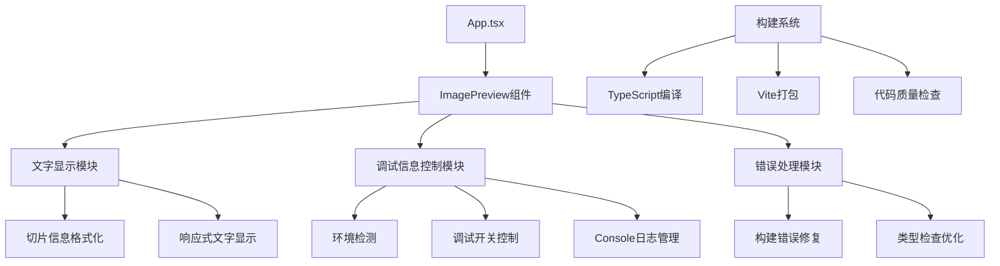

# ImagePreview组件优化设计文档

## 概述

本设计文档针对ImagePreview组件的三个核心优化问题：文字显示格式修复、调试信息隐藏功能、以及构建流程修复。通过系统性的技术方案，提升组件的可用性、用户体验和项目的可维护性。

## 架构设计

### 整体架构图



### 核心模块设计

#### 1. 文字显示格式化模块
- **职责**: 确保切片信息按指定格式正确显示
- **输入**: 切片数据 (index, width, height, size)
- **输出**: 格式化的显示文本
- **格式**: `切片 {index} {width} × {height} | {size} KB`

#### 2. 调试信息控制模块
- **职责**: 根据环境和用户设置控制调试信息显示
- **功能**: 环境检测、开关控制、日志管理
- **策略**: 生产环境隐藏，开发环境可选显示

#### 3. 构建错误修复模块
- **职责**: 解决TypeScript编译错误和构建问题
- **范围**: 未使用变量清理、类型定义优化、导入语句整理

## 组件和接口设计

### 1. 文字显示接口

```typescript
interface SliceDisplayInfo {
  index: number;
  width: number;
  height: number;
  size: number; // 以字节为单位
}

interface FormattedSliceInfo {
  title: string;        // "切片 {index}"
  dimensions: string;   // "{width} × {height}"
  fileSize: string;     // "{size} KB"
  fullText: string;     // 完整格式化文本
}

// 格式化函数
function formatSliceInfo(slice: SliceDisplayInfo): FormattedSliceInfo;
```

### 2. 调试控制接口

```typescript
interface DebugConfig {
  enabled: boolean;
  showConsole: boolean;
  showDevPanel: boolean;
  environment: 'development' | 'production';
}

interface DebugController {
  isDebugMode(): boolean;
  toggleDebug(enabled?: boolean): void;
  log(message: string, data?: any): void;
  hideDebugInfo(): void;
}
```

### 3. 环境检测工具

```typescript
interface EnvironmentDetector {
  isDevelopment(): boolean;
  isProduction(): boolean;
  getBuildMode(): 'development' | 'production';
}
```

## 数据模型

### 1. 切片信息模型优化

```typescript
// 现有的ImageSlice接口保持不变，添加格式化方法
interface ImageSlice {
  index: number;
  url: string;
  blob: Blob;
  width: number;
  height: number;
  
  // 新增格式化方法
  getFormattedInfo(): FormattedSliceInfo;
  getDisplayTitle(): string;
  getDimensionsText(): string;
  getFileSizeText(): string;
}
```

### 2. 调试状态模型

```typescript
interface DebugState {
  isEnabled: boolean;
  showConsoleOutput: boolean;
  showDevPanel: boolean;
  logLevel: 'none' | 'error' | 'warn' | 'info' | 'debug';
}
```

## 错误处理策略

### 1. 构建错误修复方案

#### TypeScript错误分析
基于构建输出，发现以下错误类型：
- **未使用导入**: `ImageSlice`, `React`, `StrictMode`
- **未使用变量**: `layoutMode`, `isTablet`, `isDesktop`, `touchEnd`
- **语法错误**: `touchEnd` 变量声明缺少逗号

#### 修复策略
1. **清理未使用导入**: 移除或添加 `// eslint-disable-next-line` 注释
2. **处理未使用变量**: 
   - 删除真正不需要的变量
   - 为暂时不用但将来需要的变量添加下划线前缀
   - 使用 `void` 操作符标记已知未使用的变量
3. **修复语法错误**: 补充缺失的语法元素

### 2. 运行时错误处理

```typescript
interface ErrorBoundary {
  handleImageLoadError(error: Error, sliceIndex: number): void;
  handleFormatError(error: Error, slice: ImageSlice): void;
  handleDebugError(error: Error): void;
}
```

### 3. 用户友好错误提示

```typescript
interface UserErrorHandler {
  showImageLoadError(sliceIndex: number): void;
  showFormatError(): void;
  showBuildError(details: string): void;
}
```

## 实现方案

### 1. 文字显示格式修复

#### 实现步骤
1. **创建格式化工具函数**
```typescript
// utils/textFormatter.ts
export function formatSliceInfo(slice: ImageSlice): FormattedSliceInfo {
  const sizeInKB = Math.round(slice.blob.size / 1024);
  return {
    title: `切片 ${slice.index + 1}`,
    dimensions: `${slice.width} × ${slice.height}`,
    fileSize: `${sizeInKB} KB`,
    fullText: `切片 ${slice.index + 1} ${slice.width} × ${slice.height} | ${sizeInKB} KB`
  };
}
```

2. **更新ImagePreview组件**
- 替换现有的文字显示逻辑
- 确保所有显示位置使用统一格式
- 添加格式验证和错误处理

3. **响应式适配**
- 移动端简化显示格式
- 桌面端完整显示格式
- 确保不同屏幕尺寸下的可读性

### 2. 调试信息隐藏功能

#### 实现步骤
1. **创建调试控制器**
```typescript
// utils/debugController.ts
class DebugController {
  private config: DebugConfig;
  
  constructor() {
    this.config = {
      enabled: process.env.NODE_ENV === 'development',
      showConsole: true,
      showDevPanel: true,
      environment: process.env.NODE_ENV as 'development' | 'production'
    };
  }
  
  log(message: string, data?: any): void {
    if (this.config.enabled && this.config.showConsole) {
      console.log(`[Debug] ${message}`, data);
    }
  }
  
  hideProductionDebugInfo(): void {
    if (this.config.environment === 'production') {
      // 移除或隐藏调试面板
      const debugSection = document.querySelector('.debug-section');
      if (debugSection) {
        debugSection.style.display = 'none';
      }
    }
  }
}
```

2. **环境检测和条件渲染**
- 在App.tsx中添加环境检测
- 生产环境下隐藏调试信息面板
- 保留必要的错误提示功能

3. **Console日志管理**
- 包装所有console.log调用
- 生产环境下禁用调试日志
- 保留错误和警告日志

### 3. 构建流程修复

#### 修复清单
1. **App.tsx修复**
   - 移除未使用的 `ImageSlice` 导入
   - 保留类型导入但添加类型注释

2. **ExportControls.tsx修复**
   - 移除未使用的 `React` 导入（使用JSX时不需要）

3. **ImagePreview.tsx修复**
   - 移除未使用的变量: `layoutMode`, `isTablet`, `isDesktop`
   - 修复 `touchEnd` 变量声明语法错误
   - 清理其他未使用的导入

4. **useI18nContext.tsx修复**
   - 修复导入语法错误
   - 确保所有导入都被正确使用

5. **main.tsx修复**
   - 移除未使用的 `StrictMode` 导入

## 测试策略

### 1. 单元测试

```typescript
// 文字格式化测试
describe('formatSliceInfo', () => {
  it('should format slice info correctly', () => {
    const slice = createMockSlice({ index: 0, width: 800, height: 600, size: 1024 });
    const formatted = formatSliceInfo(slice);
    expect(formatted.fullText).toBe('切片 1 800 × 600 | 1 KB');
  });
});

// 调试控制器测试
describe('DebugController', () => {
  it('should hide debug info in production', () => {
    const controller = new DebugController();
    controller.config.environment = 'production';
    expect(controller.isDebugMode()).toBe(false);
  });
});
```

### 2. 集成测试

```typescript
// 组件集成测试
describe('ImagePreview Integration', () => {
  it('should display formatted slice info correctly', () => {
    render(<ImagePreview imageSlices={mockSlices} />);
    expect(screen.getByText(/切片 1 800 × 600 \| 1 KB/)).toBeInTheDocument();
  });
  
  it('should hide debug info in production build', () => {
    process.env.NODE_ENV = 'production';
    render(<App />);
    expect(screen.queryByText('调试信息')).not.toBeInTheDocument();
  });
});
```

### 3. 构建测试

```bash
# 构建测试脚本
#!/bin/bash
echo "开始构建测试..."

# 清理构建目录
rm -rf dist/

# 执行TypeScript检查
echo "执行TypeScript检查..."
pnpm run type-check

# 执行构建
echo "执行构建..."
pnpm run build

# 验证构建结果
if [ -d "dist" ]; then
  echo "✅ 构建成功"
  ls -la dist/
else
  echo "❌ 构建失败"
  exit 1
fi
```

### 4. 用户体验测试

- **文字显示测试**: 验证各种屏幕尺寸下的文字格式
- **调试信息测试**: 验证生产环境下调试信息的隐藏
- **性能测试**: 确保优化后的性能不低于原版本
- **兼容性测试**: 验证在不同浏览器下的表现

## 部署和维护

### 1. 部署检查清单

- [ ] 所有TypeScript错误已修复
- [ ] 构建命令执行成功
- [ ] 生产环境下调试信息已隐藏
- [ ] 文字格式显示正确
- [ ] 所有现有功能正常工作
- [ ] 代码通过质量检查

### 2. 监控和维护

- **错误监控**: 监控生产环境中的JavaScript错误
- **性能监控**: 监控组件渲染性能
- **用户反馈**: 收集用户对文字显示和界面简洁性的反馈

### 3. 版本管理

- **版本号**: 1.1.0 (功能优化版本)
- **变更日志**: 详细记录所有修改内容
- **回滚方案**: 保留原版本代码以备回滚

## 风险评估和缓解

### 1. 技术风险

**风险**: 修改现有组件可能影响其他功能
**缓解**: 
- 充分的测试覆盖
- 渐进式修改
- 保留原有接口

**风险**: 构建配置变更可能导致新问题
**缓解**:
- 备份现有配置
- 分步骤验证
- 准备回滚方案

### 2. 用户体验风险

**风险**: 调试信息隐藏可能影响问题排查
**缓解**:
- 保留开发环境下的调试功能
- 提供用户友好的错误提示
- 添加问题反馈机制

### 3. 维护风险

**风险**: 代码复杂度增加
**缓解**:
- 充分的代码注释
- 清晰的模块划分
- 完善的文档

## 成功指标

### 1. 技术指标
- [ ] 构建成功率: 100%
- [ ] TypeScript错误数: 0
- [ ] 代码覆盖率: >80%
- [ ] 构建时间: <30秒

### 2. 用户体验指标
- [ ] 文字显示格式正确率: 100%
- [ ] 生产环境调试信息隐藏率: 100%
- [ ] 页面加载性能: 无明显下降
- [ ] 用户满意度: 提升

### 3. 维护指标
- [ ] 代码可读性评分: >8/10
- [ ] 文档完整性: 100%
- [ ] 问题解决时间: <24小时