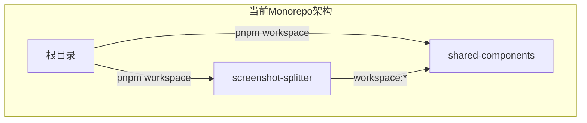
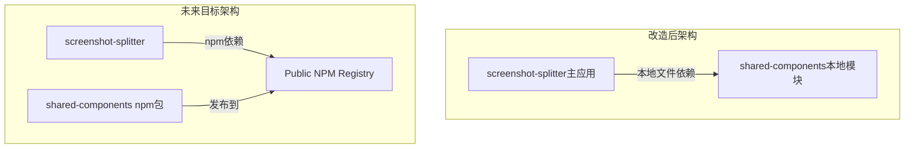

# 多仓库架构改造设计文档

## 概述
本设计文档详细描述了将当前monorepo结构的长截图分割工具项目改造为多仓库架构的技术方案。改造核心是移除pnpm workspace，重构依赖管理，实现配置化，并为未来完全分离做好准备。

## 架构设计

### 当前架构分析


### 目标架构设计


## 组件和接口设计

### 1. 项目结构改造
**改造方案：**
- 移除根目录的`pnpm-workspace.yaml`文件
- 重构根目录`package.json`，移除workspace相关配置
- 将`screenshot-splitter`作为主应用目录
- `shared-components`作为本地模块目录

**目录结构：**
```
/
├── screenshot-splitter/          # 主应用
│   ├── src/
│   ├── config/                  # 配置目录（新增）
│   ├── package.json           # 移除workspace依赖
│   └── ...
├── shared-components/          # 本地模块
│   ├── src/
│   ├── package.json           # 配置为可发布npm包
│   └── ...
└── package.json               # 根目录package.json（简化）
```

### 2. 依赖管理改造
**shared-components包配置：**
```json
{
  "name": "@tencent/shared-components",
  "version": "1.0.0",
  "main": "dist/index.js",
  "types": "dist/index.d.ts",
  "scripts": {
    "build": "tsc",
    "prepublishOnly": "npm run build"
  }
}
```

**screenshot-splitter依赖配置：**
```json
{
  "dependencies": {
    "@tencent/shared-components": "file:../shared-components"
  }
}
```

### 3. 配置化改造
**配置目录结构：**
```
screenshot-splitter/config/
├── app/
│   ├── app.config.ts          # 应用配置
│   └── routing.config.ts      # 路由配置
├── build/
│   ├── vite.config.ts         # Vite配置
│   └── tsconfig.json          # TypeScript配置
├── env/
│   ├── development.ts         # 开发环境配置
│   ├── production.ts           # 生产环境配置
│   └── test.ts                # 测试环境配置
└── constants/
    ├── app.constants.ts       # 应用常量
    └── export.constants.ts    # 导出相关常量
```

## 数据模型设计

### 配置数据模型
```typescript
// config/app/app.config.ts
export interface AppConfig {
  name: string;
  version: string;
  environment: 'development' | 'production' | 'test';
  features: {
    i18n: boolean;
    debug: boolean;
    analytics: boolean;
  };
}

// config/build/vite.config.ts
export interface BuildConfig {
  input: string;
  output: string;
  external: string[];
  plugins: any[];
}
```

## 错误处理设计

### 依赖解析错误处理
```typescript
class DependencyResolver {
  static resolveSharedComponents() {
    try {
      // 尝试解析本地模块
      return require('../shared-components');
    } catch (error) {
      // 回退方案：尝试从npm安装
      this.fallbackToNPM();
      throw new Error('Shared components dependency resolution failed');
    }
  }
  
  private static fallbackToNPM() {
    console.warn(' Falling back to npm installation...');
    // 实现npm安装逻辑
  }
}
```

### 构建错误处理
```typescript
class BuildErrorHandler {
  static handleWorkspaceMigrationError(error: Error) {
    if (error.message.includes('workspace')) {
      console.error('Workspace dependency detected during build');
      console.error('Please run the migration script first');
      process.exit(1);
    }
  }
}
```

## 测试策略

### 单元测试
- **依赖解析测试**：验证本地模块依赖解析功能
- **配置加载测试**：测试配置文件的正确加载
- **构建流程测试**：验证构建过程不受workspace影响

### 集成测试
- **应用启动测试**：验证改造后应用能正常启动
- **功能回归测试**：确保所有现有功能正常工作
- **依赖管理测试**：测试本地模块依赖的正确性

### E2E测试
- **完整工作流测试**：上传->分割->导出完整流程
- **性能基准测试**：确保性能不受架构改造影响

## 迁移策略

### 分阶段迁移方案
1. **第一阶段**：代码结构改造，移除workspace配置
2. **第二阶段**：依赖管理改造，配置本地模块依赖
3. **第三阶段**：配置化改造，提取所有配置到config目录
4. **第四阶段**：测试验证，确保功能完整性

### 回滚方案
- 保留原有的package.json和配置备份
- 提供一键回滚脚本恢复monorepo结构
- 详细的迁移日志记录变更内容

## 技术决策和理由

### 1. 使用file:依赖而非npm link
**理由**：`file:../shared-components`依赖方式：
- 更稳定，不会出现symlink相关问题
- 更好的版本控制
- 更接近真实的npm依赖体验

### 2. 配置集中化管理
**理由**：将配置抽到config目录：
- 提高可维护性
- 便于环境切换
- 支持更好的测试覆盖

### 3. 渐进式迁移策略
**理由**：分阶段实施：
- 降低风险
- 便于问题排查
- 支持平滑回滚

## 风险评估和缓解措施

### 风险1：依赖解析失败
**缓解**：实现fallback机制和详细错误日志

### 风险2：构建性能下降  
**缓解**：优化构建配置，使用缓存策略

### 风险3：功能回归
**缓解**：完善的测试覆盖和回归测试

## 成功指标
- ✅ 构建成功率达到100%
- ✅ 测试通过率100%
- ✅ 性能指标不下降
- ✅ 功能回归测试通过
- ✅ 开发体验流畅