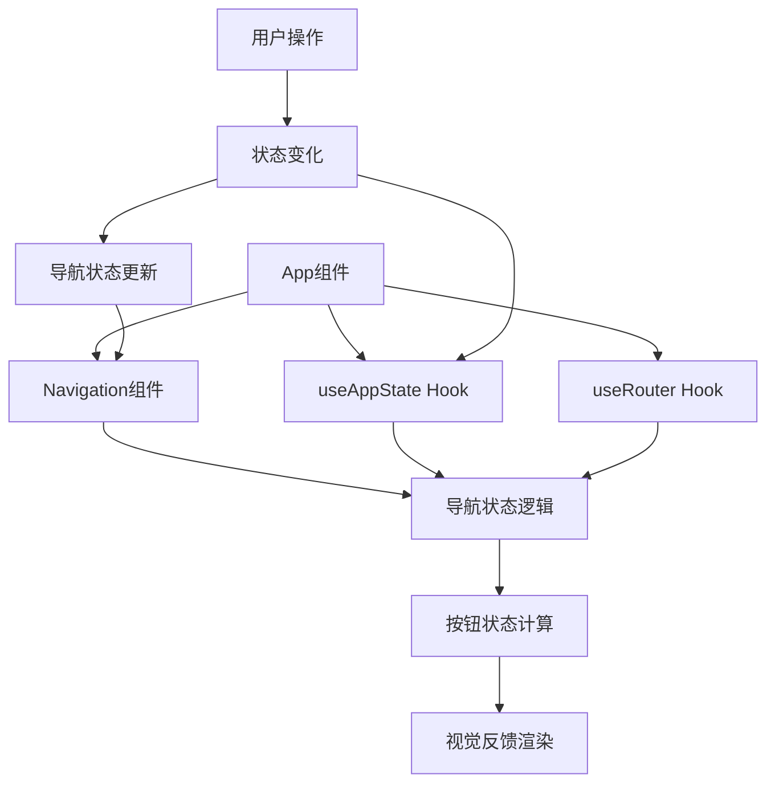
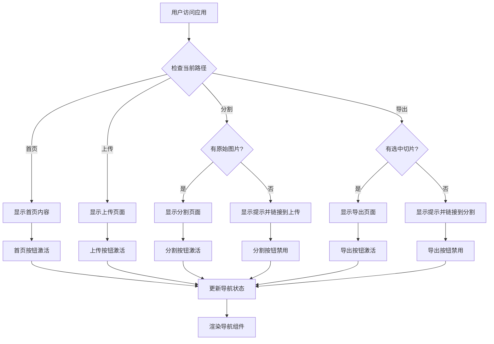
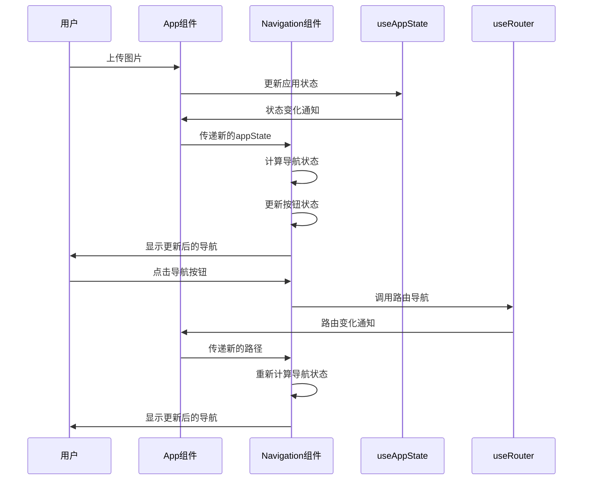

# 导航流程修复设计文档

## 概述

当前的导航组件（Navigation.tsx）存在状态切换问题，导航按钮（🏠首页、📤上传、✂️分割、💾导出）应该是顺序流程的，对应的状态和页面应该是关联的，但目前没有关联。本设计文档提供了一个解决方案，通过修改导航组件和相关逻辑，使导航按钮状态正确反映用户在应用中的位置和可用操作。

## 架构

### 当前架构分析

当前应用架构采用了React函数式组件和自定义Hooks的方式构建：

1. **Navigation组件**：负责显示导航按钮和面包屑，但缺少与应用状态的关联
2. **useRouter Hook**：提供路由状态和导航方法，基于hash模式路由
3. **useAppState Hook**：管理应用状态，包含图片处理和选择状态
4. **App组件**：应用的主组件，整合各个功能模块

### 修改后的架构

我们的修改将主要集中在Navigation组件上，同时需要确保它能够正确地与应用状态（useAppState）和路由状态（useRouter）进行交互。



## 组件和接口

### 修改后的Navigation组件接口

```typescript
interface NavigationItem {
  path: string;
  name: string;
  icon?: string;
  disabled?: boolean;
  active?: boolean;
}

interface NavigationProps {
  items?: NavigationItem[];
  showBreadcrumb?: boolean;
  className?: string;
  appState: AppState; // 新增：传入应用状态
  onNavigationStateChange?: (state: NavigationState) => void; // 新增：状态变化回调
}

interface NavigationState {
  currentStep: string;
  availableSteps: string[];
  completedSteps: string[];
  blockedSteps: string[];
}
```

### 新增的导航状态逻辑

我们将在Navigation组件中添加一个新的函数，用于根据应用状态和当前路径确定每个导航项的状态：

```typescript
function determineNavigationState(
  items: NavigationItem[],
  currentPath: string,
  appState: AppState
): {
  items: NavigationItem[];
  navigationState: NavigationState;
} {
  const hasOriginalImage = !!appState.originalImage;
  const hasImageSlices = appState.imageSlices.length > 0;
  const hasSelectedSlices = appState.selectedSlices.size > 0;
  
  const updatedItems = items.map(item => {
    let disabled = false;
    let active = currentPath === item.path;
    
    // 根据路径和应用状态确定是否禁用
    switch (item.path) {
      case '/':
        // 首页始终可用
        disabled = false;
        break;
      case '/upload':
        // 上传页面始终可用
        disabled = false;
        break;
      case '/split':
        // 如果没有上传图片，则禁用分割按钮
        disabled = !hasOriginalImage;
        break;
      case '/export':
        // 如果没有选择任何切片，则禁用导出按钮
        disabled = !hasSelectedSlices;
        break;
      default:
        disabled = false;
    }
    
    return {
      ...item,
      disabled,
      active
    };
  });
  
  // 计算导航状态
  const completedSteps: string[] = [];
  const availableSteps: string[] = [];
  const blockedSteps: string[] = [];
  
  items.forEach(item => {
    const updatedItem = updatedItems.find(ui => ui.path === item.path);
    if (updatedItem) {
      if (updatedItem.disabled) {
        blockedSteps.push(item.path);
      } else if (updatedItem.active) {
        availableSteps.push(item.path);
      } else {
        // 判断是否为已完成步骤
        switch (item.path) {
          case '/':
            completedSteps.push(item.path);
            break;
          case '/upload':
            if (hasOriginalImage) completedSteps.push(item.path);
            else availableSteps.push(item.path);
            break;
          case '/split':
            if (hasImageSlices) completedSteps.push(item.path);
            else if (hasOriginalImage) availableSteps.push(item.path);
            break;
          case '/export':
            if (hasSelectedSlices) availableSteps.push(item.path);
            break;
        }
      }
    }
  });
  
  const navigationState: NavigationState = {
    currentStep: currentPath,
    availableSteps,
    completedSteps,
    blockedSteps
  };
  
  return { items: updatedItems, navigationState };
}
```

### 新增的导航状态Hook

为了更好地管理导航状态，我们将创建一个专门的Hook：

```typescript
function useNavigationState(appState: AppState, currentPath: string) {
  const [navigationState, setNavigationState] = useState<NavigationState>({
    currentStep: currentPath,
    availableSteps: ['/'],
    completedSteps: [],
    blockedSteps: ['/split', '/export']
  });
  
  useEffect(() => {
    const { navigationState: newState } = determineNavigationState(
      defaultNavigationItems,
      currentPath,
      appState
    );
    setNavigationState(newState);
  }, [appState, currentPath]);
  
  return navigationState;
}
```

## 数据模型

### 现有数据模型

我们将利用现有的数据模型，主要涉及：

1. **AppState**：应用状态，包含图片处理和选择状态
   ```typescript
   interface AppState {
     worker: Worker | null;
     blobs: Blob[];
     objectUrls: string[];
     originalImage: HTMLImageElement | null;
     imageSlices: ImageSlice[];
     selectedSlices: Set<number>;
     isProcessing: boolean;
     splitHeight: number;
     fileName: string;
   }
   ```

2. **RouterState**：路由状态，包含当前路径和路由信息
   ```typescript
   interface RouterState {
     currentPath: string;
     currentRoute: RouteConfig | null;
     params: Record<string, string>;
     query: Record<string, string>;
     history: string[];
   }
   ```

### 新增数据模型

```typescript
interface NavigationState {
  currentStep: string;
  availableSteps: string[];
  completedSteps: string[];
  blockedSteps: string[];
}

interface NavigationMetrics {
  totalSteps: number;
  completedSteps: number;
  currentStepIndex: number;
  progressPercentage: number;
}
```

## 错误处理

### 错误情况分析

在导航状态逻辑中，我们需要考虑以下错误情况：

1. **应用状态为空**：确保即使应用状态为空，导航组件也能正常工作
2. **路由不匹配**：处理用户直接访问URL但应用状态不匹配的情况
3. **状态不一致**：处理应用状态和路由状态不一致的情况
4. **网络错误**：处理图片处理失败等网络相关错误
5. **浏览器兼容性**：处理不同浏览器的路由行为差异

### 错误处理策略

```typescript
function handleNavigationError(error: NavigationError, context: NavigationContext) {
  switch (error.type) {
    case 'INVALID_STATE':
      // 状态不一致，重置到安全状态
      return {
        action: 'redirect',
        path: '/',
        message: '检测到状态异常，已重置到首页'
      };
      
    case 'MISSING_PREREQUISITES':
      // 缺少前置条件，显示提示并提供导航
      return {
        action: 'show_warning',
        message: `请先完成${error.prerequisite}步骤`,
        suggestedPath: error.suggestedPath
      };
      
    case 'PROCESSING_ERROR':
      // 处理错误，保持当前状态但显示错误信息
      return {
        action: 'show_error',
        message: error.message,
        allowRetry: true
      };
      
    default:
      return {
        action: 'log_error',
        message: '未知导航错误'
      };
  }
}
```

### 边缘情况处理

1. **页面刷新处理**：
   ```typescript
   useEffect(() => {
     // 页面刷新时，根据localStorage恢复状态
     const persistedState = loadState();
     if (persistedState && currentPath !== '/') {
       // 验证当前路径是否与持久化状态匹配
       const isValidState = validateNavigationState(currentPath, persistedState);
       if (!isValidState) {
         // 状态不匹配，重定向到合适的页面
         const suggestedPath = getSuggestedPath(persistedState);
         push(suggestedPath);
       }
     }
   }, []);
   ```

2. **直接URL访问处理**：
   ```typescript
   const handleDirectAccess = (path: string, appState: AppState) => {
     const requirements = getPathRequirements(path);
     const missingRequirements = requirements.filter(req => !checkRequirement(req, appState));
     
     if (missingRequirements.length > 0) {
       return {
         allowed: false,
         redirectTo: getFirstMissingRequirementPath(missingRequirements[0]),
         message: `请先完成${missingRequirements[0].name}`
       };
     }
     
     return { allowed: true };
   };
   ```

## 测试策略

### 单元测试

1. **导航状态逻辑测试**：
   ```typescript
   describe('determineNavigationState', () => {
     it('should disable split button when no image uploaded', () => {
       const appState = createMockAppState({ originalImage: null });
       const result = determineNavigationState(defaultItems, '/split', appState);
       
       const splitItem = result.items.find(item => item.path === '/split');
       expect(splitItem?.disabled).toBe(true);
     });
     
     it('should enable export button when slices are selected', () => {
       const appState = createMockAppState({ 
         selectedSlices: new Set([0, 1]) 
       });
       const result = determineNavigationState(defaultItems, '/export', appState);
       
       const exportItem = result.items.find(item => item.path === '/export');
       expect(exportItem?.disabled).toBe(false);
     });
   });
   ```

2. **Navigation组件测试**：
   ```typescript
   describe('Navigation Component', () => {
     it('should render correct button states', () => {
       const appState = createMockAppState();
       render(<Navigation appState={appState} />);
       
       expect(screen.getByRole('button', { name: '首页' })).not.toBeDisabled();
       expect(screen.getByRole('button', { name: '分割' })).toBeDisabled();
     });
     
     it('should update states when app state changes', () => {
       const { rerender } = render(<Navigation appState={emptyAppState} />);
       
       const updatedAppState = { ...emptyAppState, originalImage: mockImage };
       rerender(<Navigation appState={updatedAppState} />);
       
       expect(screen.getByRole('button', { name: '分割' })).not.toBeDisabled();
     });
   });
   ```

### 集成测试

1. **导航流程测试**：
   ```typescript
   describe('Navigation Flow Integration', () => {
     it('should complete full user journey', async () => {
       render(<App />);
       
       // 1. 开始在首页
       expect(screen.getByText('首页')).toHaveClass('active');
       
       // 2. 上传图片
       const fileInput = screen.getByLabelText('上传图片');
       fireEvent.change(fileInput, { target: { files: [mockImageFile] } });
       
       // 3. 等待处理完成，分割按钮应该可用
       await waitFor(() => {
         expect(screen.getByRole('button', { name: '分割' })).not.toBeDisabled();
       });
       
       // 4. 导航到分割页面
       fireEvent.click(screen.getByRole('button', { name: '分割' }));
       expect(screen.getByText('分割')).toHaveClass('active');
       
       // 5. 选择切片
       const firstSlice = screen.getByTestId('slice-0');
       fireEvent.click(firstSlice);
       
       // 6. 导出按钮应该可用
       expect(screen.getByRole('button', { name: '导出' })).not.toBeDisabled();
     });
   });
   ```

### 端到端测试

1. **完整用户流程测试**：
   - 测试完整的用户流程：首页 -> 上传 -> 分割 -> 导出
   - 测试边缘情况，如刷新页面、使用浏览器前进/后退按钮等
   - 测试直接URL访问的处理

2. **性能测试**：
   - 测试导航状态更新的响应时间
   - 测试大量切片时的导航性能
   - 测试内存泄漏情况

## 实现计划

### 阶段1：核心导航逻辑实现

1. **修改Navigation组件**：
   - 添加appState属性到组件props
   - 实现determineNavigationState函数
   - 在渲染导航项之前应用determineNavigationState函数
   - 添加状态变化的过渡动画

2. **创建useNavigationState Hook**：
   - 封装导航状态逻辑
   - 提供状态变化监听
   - 实现状态持久化

### 阶段2：App组件集成

1. **修改App组件**：
   ```jsx
   <Navigation 
     appState={state} 
     onNavigationStateChange={handleNavigationStateChange}
   />
   ```

2. **增强路由逻辑**：
   - 在App组件中增强路由逻辑，处理用户直接访问URL但应用状态不匹配的情况
   - 添加路由守卫，验证访问权限
   - 实现状态恢复逻辑

### 阶段3：视觉反馈和用户体验

1. **更新CSS样式**：
   - 增强按钮状态的视觉区分
   - 添加状态切换的过渡动画
   - 优化响应式设计

2. **添加用户提示**：
   - 实现tooltip提示，说明按钮禁用原因
   - 添加进度指示器
   - 实现面包屑导航的状态同步

### 阶段4：错误处理和边缘情况

1. **实现错误处理机制**：
   - 添加错误边界组件
   - 实现错误恢复策略
   - 添加用户友好的错误提示

2. **处理边缘情况**：
   - 页面刷新状态恢复
   - 浏览器前进/后退处理
   - 网络错误处理

### 阶段5：测试和优化

1. **编写测试用例**：
   - 单元测试
   - 集成测试
   - 端到端测试

2. **性能优化**：
   - 优化状态更新频率
   - 减少不必要的重渲染
   - 优化内存使用

## 设计决策说明

### 1. 为什么选择在Navigation组件中实现状态逻辑

**优点**：
- Navigation组件是显示导航按钮的地方，将状态逻辑放在这里可以保持关注点分离
- 避免在App组件中添加过多的导航相关逻辑
- 便于单独测试导航逻辑

**缺点**：
- 增加了Navigation组件的复杂度
- 需要传递更多的props

**决策理由**：关注点分离的好处大于复杂度增加的成本，且通过Hook可以很好地封装复杂逻辑。

### 2. 为什么不创建新的全局状态管理

**考虑的方案**：
- 使用Redux或Zustand管理导航状态
- 创建全局Context

**选择现有方案的原因**：
- 当前的修改范围较小，不需要引入新的状态管理库
- 利用现有的useRouter和useAppState已经足够满足需求
- 避免过度工程化

### 3. 为什么不修改路由配置

**考虑的方案**：
- 在路由配置中添加权限验证
- 修改路由守卫逻辑

**选择现有方案的原因**：
- 当前的路由配置已经满足基本需求
- 修改路由配置可能会影响其他功能，增加风险
- 在组件层面处理更加灵活

### 4. 状态同步策略选择

**方案对比**：
1. **实时同步**：每次状态变化立即更新导航
2. **防抖同步**：延迟更新，减少频繁渲染
3. **手动同步**：用户操作时才更新

**选择实时同步的原因**：
- 用户体验最佳，状态变化立即可见
- 导航状态计算成本较低
- 符合用户对现代Web应用的期望

## 流程图

### 导航状态决策流程



### 状态同步流程



## 状态转换表

| 当前页面 | 有原始图片 | 有图片切片 | 有选中切片 | 首页按钮 | 上传按钮 | 分割按钮 | 导出按钮 |
|---------|-----------|-----------|-----------|---------|---------|---------|---------|
| 首页 | ❌ | ❌ | ❌ | 激活 | 可点击 | 禁用 | 禁用 |
| 首页 | ✅ | ❌ | ❌ | 激活 | 已完成 | 可点击 | 禁用 |
| 首页 | ✅ | ✅ | ❌ | 激活 | 已完成 | 已完成 | 禁用 |
| 首页 | ✅ | ✅ | ✅ | 激活 | 已完成 | 已完成 | 可点击 |
| 上传 | ❌ | ❌ | ❌ | 可点击 | 激活 | 禁用 | 禁用 |
| 上传 | ✅ | ❌ | ❌ | 可点击 | 激活 | 可点击 | 禁用 |
| 分割 | ✅ | ✅ | ❌ | 可点击 | 已完成 | 激活 | 禁用 |
| 分割 | ✅ | ✅ | ✅ | 可点击 | 已完成 | 激活 | 可点击 |
| 导出 | ✅ | ✅ | ✅ | 可点击 | 已完成 | 已完成 | 激活 |

## 性能考虑

### 优化策略

1. **状态计算优化**：
   ```typescript
   const navigationState = useMemo(() => {
     return determineNavigationState(items, currentPath, appState);
   }, [items, currentPath, appState.originalImage, appState.imageSlices.length, appState.selectedSlices.size]);
   ```

2. **渲染优化**：
   ```typescript
   const NavigationItem = React.memo(({ item, onClick }) => {
     return (
       <button
         className={getButtonClassName(item)}
         onClick={() => onClick(item.path)}
         disabled={item.disabled}
       >
         {item.icon} {item.name}
       </button>
     );
   });
   ```

3. **事件处理优化**：
   ```typescript
   const handleNavClick = useCallback((path: string, disabled?: boolean) => {
     if (!disabled) {
       push(path);
     }
   }, [push]);
   ```

### 内存管理

1. **清理副作用**：确保组件卸载时清理所有监听器和定时器
2. **避免内存泄漏**：正确处理Object URLs和Worker实例
3. **优化重渲染**：使用React.memo和useMemo减少不必要的渲染

## 可访问性考虑

1. **键盘导航**：确保所有导航按钮都可以通过键盘访问
2. **屏幕阅读器**：添加适当的aria-label和role属性
3. **焦点管理**：正确管理焦点状态，特别是在路由切换时
4. **颜色对比度**：确保按钮状态的颜色对比度符合WCAG标准

## 国际化支持

导航组件需要支持多语言，确保按钮文本和提示信息都能正确本地化：

```typescript
const Navigation: React.FC<NavigationProps> = ({ appState, ...props }) => {
  const { t } = useI18n();
  
  const localizedItems = defaultNavigationItems.map(item => ({
    ...item,
    name: t(`navigation.${item.name.toLowerCase()}`)
  }));
  
  // ... 其他逻辑
};