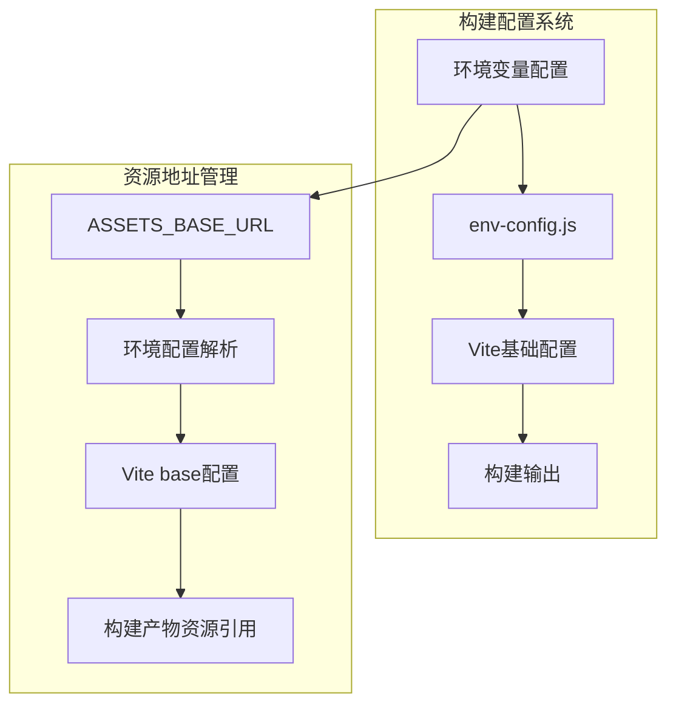

# 移除单文件构建模式并实现可配置资源地址 - 技术设计文档

## 概述

本设计文档详细说明了如何移除单文件HTML构建模式，并将资源引用地址改为可配置的预定义地址的技术实现方案。

## 架构设计

### 当前架构分析

当前系统采用双模式构建架构：
- **SPA模式**：多文件输出，支持代码分割
- **单文件模式**：所有资源内联到单个HTML文件

### 目标架构

移除单文件模式，专注于SPA模式，并增强资源地址配置能力：



## 组件和接口

### 1. 环境配置模块 (`env-config.js`)

**新增功能**：
```javascript
/**
 * 获取资源基础URL
 * @returns {string} 资源基础URL
 */
export function getAssetsBaseUrl() {
  return process.env.VITE_ASSETS_BASE_URL || 
         process.env.ASSETS_BASE_URL || 
         './';
}

/**
 * 获取完整的构建配置（增强版）
 */
export function getBuildConfig(options = {}) {
  return {
    // ... 现有配置
    assetsBaseUrl: getAssetsBaseUrl(),
    // ... 其他配置
  };
}
```

### 2. Vite配置模块 (`vite.config.base.js`)

**变更内容**：
- 移除单文件模式相关插件和配置
- 集成资源地址配置

```javascript
export function createBaseConfig(options = {}) {
  const { assetsBaseUrl = './' } = options;
  
  return defineConfig({
    base: assetsBaseUrl,
    // 移除单文件模式相关配置
    plugins: [
      // 仅保留SPA模式插件
    ],
    build: {
      // 仅保留SPA模式构建配置
    }
  });
}
```

### 3. 构建管理器 (`build-manager.js`)

**变更内容**：
- 移除单文件模式构建逻辑
- 更新构建报告生成

```javascript
function buildComponent(componentName) {
  // 仅构建SPA模式
  const result = runCommand(`pnpm run build:${componentName}:spa`);
  return { spa: result.success };
}
```

## 数据模型

### 环境变量配置

```typescript
interface BuildEnvConfig {
  // 现有配置
  mode: 'spa';
  component: string;
  env: 'development' | 'production';
  
  // 新增配置
  assetsBaseUrl: string;
}
```

### 构建配置对象

```typescript
interface BuildConfig {
  mode: string;
  component: string;
  env: string;
  isProduction: boolean;
  outDir: string;
  base: string;
  assetsBaseUrl: string; // 新增
}
```

## 错误处理

### 配置验证

```javascript
function validateAssetsBaseUrl(url) {
  if (url && !isValidUrl(url) && url !== './') {
    throw new Error(`无效的资源基础URL: ${url}`);
  }
}
```

### 向后兼容性

- 当未设置 `ASSETS_BASE_URL` 时，使用默认的相对路径 `./`
- 保持现有构建命令的兼容性
- 确保GitHub Pages部署继续正常工作

## 测试策略

### 单元测试

1. **环境配置测试**：
   - 测试默认资源地址行为
   - 测试自定义资源地址配置
   - 测试无效URL验证

2. **构建配置测试**：
   - 测试Vite配置生成
   - 测试单文件模式相关代码已移除

### 集成测试

1. **构建流程测试**：
   - 测试完整构建流程
   - 验证构建产物资源引用正确性

2. **部署测试**：
   - 测试不同环境下的资源地址配置
   - 验证CDN部署场景

### 端到端测试

1. **功能验证**：
   - 验证构建后的应用功能正常
   - 测试资源加载正确性

## 实施计划

### 阶段一：移除单文件模式
1. 删除单文件模式相关代码
2. 移除 `vite-plugin-singlefile` 依赖
3. 清理构建脚本中的单文件逻辑

### 阶段二：实现资源地址配置
1. 增强环境配置系统
2. 更新Vite配置集成
3. 添加配置验证

### 阶段三：文档更新
1. 更新README构建说明
2. 更新部署指南
3. 移除单文件模式相关文档

### 阶段四：测试验证
1. 编写单元测试
2. 执行集成测试
3. 验证端到端功能

## 风险评估

1. **向后兼容性风险**：确保现有部署不受影响
2. **配置错误风险**：添加充分的配置验证
3. **构建性能风险**：监控构建时间变化

## 性能考虑

- 移除单文件模式插件可减少构建时间
- 资源地址配置不影响运行时性能
- 保持代码分割优化 benefits

## 安全考虑

- 验证资源URL格式防止安全漏洞
- 确保CDN资源使用HTTPS
- 防止路径遍历攻击

## 监控指标

- 构建时间变化
- 构建成功率
- 资源加载成功率
- 部署配置使用情况

## 回滚方案

如果出现问题，可以：
1. 恢复环境配置变更
2. 回退到相对路径模式
3. 重新启用单文件模式（如果需要）

---

**设计决策说明**：
- 选择环境变量配置方式，便于不同环境部署
- 保持默认相对路径行为，确保向后兼容
- 彻底移除单文件模式，简化维护复杂度
- 添加配置验证，提高系统健壮性