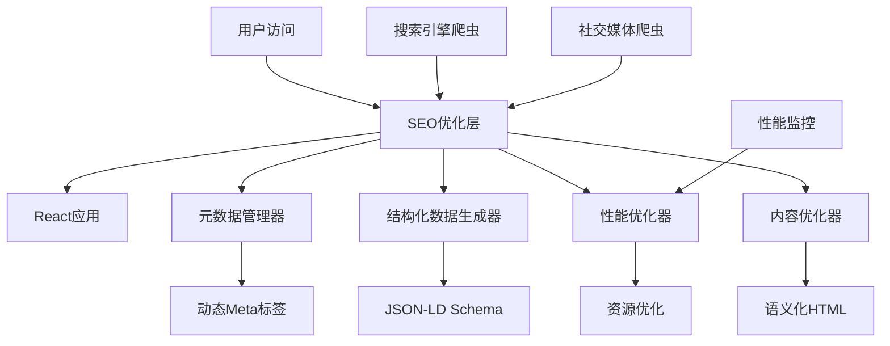

# SEO优化功能设计文档

## 概述

本设计文档详细描述了为长截图分割工具实现全面SEO优化的技术方案。该优化将通过元数据优化、结构化数据、性能优化、内容优化和技术SEO改进来提升搜索引擎排名和用户发现性。

## 架构设计

### 整体架构



### 技术栈集成

- **前端框架**: React 18 + TypeScript
- **构建工具**: Vite
- **SEO库**: React Helmet Async
- **性能监控**: Web Vitals API
- **分析工具**: Google Analytics 4
- **结构化数据**: JSON-LD

## 组件和接口设计

### 1. SEO管理器组件

```typescript
interface SEOManagerProps {
  page: 'home' | 'upload' | 'split' | 'export';
  imageCount?: number;
  selectedCount?: number;
  language: 'zh-CN' | 'en';
}

interface SEOMetadata {
  title: string;
  description: string;
  keywords: string[];
  ogTitle: string;
  ogDescription: string;
  ogImage: string;
  twitterCard: 'summary' | 'summary_large_image';
  canonicalUrl: string;
  hreflang: Record<string, string>;
}
```

### 2. 结构化数据生成器

```typescript
interface StructuredDataGenerator {
  generateWebApplication(): WebApplicationSchema;
  generateSoftwareApplication(): SoftwareApplicationSchema;
  generateBreadcrumb(path: string): BreadcrumbSchema;
  generateFAQ(): FAQSchema;
  generateHowTo(): HowToSchema;
}

interface WebApplicationSchema {
  "@context": "https://schema.org";
  "@type": "WebApplication";
  name: string;
  description: string;
  url: string;
  applicationCategory: string;
  operatingSystem: string;
  browserRequirements: string;
  offers: {
    "@type": "Offer";
    price: "0";
    priceCurrency: "USD";
  };
}
```

### 3. 性能优化器

```typescript
interface PerformanceOptimizer {
  enableImageLazyLoading(): void;
  optimizeResourceLoading(): void;
  implementCriticalCSS(): void;
  enableGzipCompression(): void;
  setupCacheHeaders(): void;
  preloadCriticalResources(): void;
}

interface PerformanceMetrics {
  fcp: number; // First Contentful Paint
  lcp: number; // Largest Contentful Paint
  fid: number; // First Input Delay
  cls: number; // Cumulative Layout Shift
  ttfb: number; // Time to First Byte
}
```

### 4. 内容优化器

```typescript
interface ContentOptimizer {
  generateOptimizedTitle(page: string, language: string): string;
  generateMetaDescription(page: string, language: string): string;
  optimizeHeadingStructure(): void;
  generateInternalLinks(): InternalLink[];
  calculateKeywordDensity(content: string): KeywordDensity;
}

interface KeywordDensity {
  [keyword: string]: {
    count: number;
    density: number;
    isOptimal: boolean;
  };
}
```

## 数据模型

### SEO配置模型

```typescript
interface SEOConfig {
  siteName: string;
  siteUrl: string;
  defaultLanguage: string;
  supportedLanguages: string[];
  socialMedia: {
    twitter: string;
    facebook: string;
    linkedin: string;
  };
  analytics: {
    googleAnalyticsId: string;
    googleSearchConsoleId: string;
  };
  keywords: {
    primary: string[];
    secondary: string[];
    longTail: string[];
  };
}
```

### 页面SEO模型

```typescript
interface PageSEO {
  path: string;
  title: {
    [language: string]: string;
  };
  description: {
    [language: string]: string;
  };
  keywords: string[];
  priority: number;
  changeFrequency: 'always' | 'hourly' | 'daily' | 'weekly' | 'monthly' | 'yearly' | 'never';
  lastModified: Date;
}
```

## 实现细节

### 1. 元数据优化实现

#### 动态Meta标签管理
```typescript
// src/components/SEO/SEOManager.tsx
import { Helmet } from 'react-helmet-async';

const SEOManager: React.FC<SEOManagerProps> = ({ page, imageCount, selectedCount, language }) => {
  const metadata = generatePageMetadata(page, { imageCount, selectedCount }, language);
  
  return (
    <Helmet>
      <title>{metadata.title}</title>
      <meta name="description" content={metadata.description} />
      <meta name="keywords" content={metadata.keywords.join(', ')} />
      
      {/* Open Graph */}
      <meta property="og:title" content={metadata.ogTitle} />
      <meta property="og:description" content={metadata.ogDescription} />
      <meta property="og:image" content={metadata.ogImage} />
      <meta property="og:type" content="website" />
      <meta property="og:url" content={metadata.canonicalUrl} />
      
      {/* Twitter Card */}
      <meta name="twitter:card" content={metadata.twitterCard} />
      <meta name="twitter:title" content={metadata.ogTitle} />
      <meta name="twitter:description" content={metadata.ogDescription} />
      <meta name="twitter:image" content={metadata.ogImage} />
      
      {/* Canonical URL */}
      <link rel="canonical" href={metadata.canonicalUrl} />
      
      {/* Hreflang */}
      {Object.entries(metadata.hreflang).map(([lang, url]) => (
        <link key={lang} rel="alternate" hrefLang={lang} href={url} />
      ))}
    </Helmet>
  );
};
```

#### 页面特定元数据生成
```typescript
// src/utils/seo/metadataGenerator.ts
export const generatePageMetadata = (
  page: string, 
  context: { imageCount?: number; selectedCount?: number }, 
  language: string
): SEOMetadata => {
  const baseUrl = 'https://screenshot-splitter.com';
  
  const metadataMap = {
    home: {
      'zh-CN': {
        title: '长截图分割工具 - 免费在线图片切割器',
        description: '免费的在线长截图分割工具，支持将长图片自动切割成多个部分。无需下载，浏览器直接使用，支持PDF和ZIP导出。',
        keywords: ['长截图分割', '图片切割', '截图工具', '在线工具', '免费']
      },
      'en': {
        title: 'Long Screenshot Splitter - Free Online Image Cutter',
        description: 'Free online tool to split long screenshots into multiple parts. No download required, works in browser, supports PDF and ZIP export.',
        keywords: ['screenshot splitter', 'image cutter', 'screenshot tool', 'online tool', 'free']
      }
    },
    upload: {
      'zh-CN': {
        title: '上传长截图 - 长截图分割工具',
        description: '上传您的长截图文件，支持PNG、JPG、JPEG格式。我们的工具将自动识别并准备分割您的图片。',
        keywords: ['上传截图', '图片上传', '长截图处理']
      },
      'en': {
        title: 'Upload Long Screenshot - Screenshot Splitter',
        description: 'Upload your long screenshot file. Supports PNG, JPG, JPEG formats. Our tool will automatically detect and prepare to split your image.',
        keywords: ['upload screenshot', 'image upload', 'long screenshot processing']
      }
    },
    split: {
      'zh-CN': {
        title: `图片分割设置 ${context.imageCount ? `- ${context.imageCount}个切片` : ''} - 长截图分割工具`,
        description: `调整分割设置并预览切片效果。${context.imageCount ? `当前已生成${context.imageCount}个切片，` : ''}选择需要的部分进行导出。`,
        keywords: ['图片分割', '切片预览', '分割设置']
      },
      'en': {
        title: `Image Split Settings ${context.imageCount ? `- ${context.imageCount} slices` : ''} - Screenshot Splitter`,
        description: `Adjust split settings and preview slice effects. ${context.imageCount ? `Currently generated ${context.imageCount} slices, ` : ''}select the parts you need for export.`,
        keywords: ['image splitting', 'slice preview', 'split settings']
      }
    },
    export: {
      'zh-CN': {
        title: `导出图片 ${context.selectedCount ? `- 已选择${context.selectedCount}个切片` : ''} - 长截图分割工具`,
        description: `导出您选择的图片切片。${context.selectedCount ? `已选择${context.selectedCount}个切片，` : ''}支持PDF和ZIP格式下载。`,
        keywords: ['图片导出', 'PDF导出', 'ZIP下载']
      },
      'en': {
        title: `Export Images ${context.selectedCount ? `- ${context.selectedCount} slices selected` : ''} - Screenshot Splitter`,
        description: `Export your selected image slices. ${context.selectedCount ? `${context.selectedCount} slices selected, ` : ''}supports PDF and ZIP format download.`,
        keywords: ['image export', 'PDF export', 'ZIP download']
      }
    }
  };
  
  const pageData = metadataMap[page]?.[language] || metadataMap.home[language];
  
  return {
    title: pageData.title,
    description: pageData.description,
    keywords: pageData.keywords,
    ogTitle: pageData.title,
    ogDescription: pageData.description,
    ogImage: `${baseUrl}/og-image.png`,
    twitterCard: 'summary_large_image',
    canonicalUrl: `${baseUrl}${page === 'home' ? '' : `/${page}`}`,
    hreflang: {
      'zh-CN': `${baseUrl}${page === 'home' ? '' : `/${page}`}?lang=zh-CN`,
      'en': `${baseUrl}${page === 'home' ? '' : `/${page}`}?lang=en`
    }
  };
};
```

### 2. 结构化数据实现

```typescript
// src/components/SEO/StructuredData.tsx
const StructuredData: React.FC = () => {
  const webAppSchema = {
    "@context": "https://schema.org",
    "@type": "WebApplication",
    "name": "长截图分割工具",
    "description": "免费的在线长截图分割工具，支持将长图片自动切割成多个部分",
    "url": "https://screenshot-splitter.com",
    "applicationCategory": "UtilitiesApplication",
    "operatingSystem": "Any",
    "browserRequirements": "Requires JavaScript. Requires HTML5.",
    "offers": {
      "@type": "Offer",
      "price": "0",
      "priceCurrency": "USD"
    },
    "featureList": [
      "自动长截图分割",
      "多格式支持",
      "PDF导出",
      "ZIP打包下载",
      "无需注册"
    ]
  };

  const softwareAppSchema = {
    "@context": "https://schema.org",
    "@type": "SoftwareApplication",
    "name": "长截图分割工具",
    "operatingSystem": "Web Browser",
    "applicationCategory": "UtilitiesApplication",
    "aggregateRating": {
      "@type": "AggregateRating",
      "ratingValue": "4.8",
      "ratingCount": "1250"
    },
    "offers": {
      "@type": "Offer",
      "price": "0",
      "priceCurrency": "USD"
    }
  };

  return (
    <>
      <script
        type="application/ld+json"
        dangerouslySetInnerHTML={{ __html: JSON.stringify(webAppSchema) }}
      />
      <script
        type="application/ld+json"
        dangerouslySetInnerHTML={{ __html: JSON.stringify(softwareAppSchema) }}
      />
    </>
  );
};
```

### 3. 性能优化实现

#### 图片懒加载
```typescript
// src/hooks/useLazyLoading.ts
export const useLazyLoading = () => {
  useEffect(() => {
    const images = document.querySelectorAll('img[data-src]');
    
    const imageObserver = new IntersectionObserver((entries) => {
      entries.forEach(entry => {
        if (entry.isIntersecting) {
          const img = entry.target as HTMLImageElement;
          img.src = img.dataset.src!;
          img.removeAttribute('data-src');
          imageObserver.unobserve(img);
        }
      });
    });

    images.forEach(img => imageObserver.observe(img));

    return () => imageObserver.disconnect();
  }, []);
};
```

#### 关键CSS内联
```typescript
// vite.config.ts 配置
export default defineConfig({
  plugins: [
    react(),
    {
      name: 'inline-critical-css',
      generateBundle(options, bundle) {
        // 提取关键CSS并内联到HTML
        const criticalCSS = extractCriticalCSS();
        // 注入到HTML模板
      }
    }
  ],
  build: {
    rollupOptions: {
      output: {
        manualChunks: {
          vendor: ['react', 'react-dom'],
          utils: ['./src/utils/index.ts']
        }
      }
    }
  }
});
```

### 4. 技术SEO实现

#### Robots.txt生成
```typescript
// public/robots.txt
User-agent: *
Allow: /
Disallow: /api/
Disallow: /*.json$

Sitemap: https://screenshot-splitter.com/sitemap.xml
```

#### XML Sitemap生成
```typescript
// src/utils/seo/sitemapGenerator.ts
export const generateSitemap = (): string => {
  const baseUrl = 'https://screenshot-splitter.com';
  const pages = [
    { path: '', priority: 1.0, changefreq: 'weekly' },
    { path: '/upload', priority: 0.8, changefreq: 'monthly' },
    { path: '/split', priority: 0.6, changefreq: 'monthly' },
    { path: '/export', priority: 0.6, changefreq: 'monthly' }
  ];

  const sitemap = `<?xml version="1.0" encoding="UTF-8"?>
<urlset xmlns="http://www.sitemaps.org/schemas/sitemap/0.9">
${pages.map(page => `
  <url>
    <loc>${baseUrl}${page.path}</loc>
    <lastmod>${new Date().toISOString().split('T')[0]}</lastmod>
    <changefreq>${page.changefreq}</changefreq>
    <priority>${page.priority}</priority>
  </url>
`).join('')}
</urlset>`;

  return sitemap;
};
```

## 错误处理

### SEO错误处理策略

```typescript
interface SEOError {
  type: 'metadata' | 'structured-data' | 'performance' | 'analytics';
  message: string;
  severity: 'low' | 'medium' | 'high';
  fallback?: () => void;
}

class SEOErrorHandler {
  private errors: SEOError[] = [];

  handleError(error: SEOError): void {
    this.errors.push(error);
    
    switch (error.severity) {
      case 'high':
        console.error('[SEO Critical]', error.message);
        error.fallback?.();
        break;
      case 'medium':
        console.warn('[SEO Warning]', error.message);
        break;
      case 'low':
        console.info('[SEO Info]', error.message);
        break;
    }
  }

  getErrors(): SEOError[] {
    return this.errors;
  }

  clearErrors(): void {
    this.errors = [];
  }
}
```

## 测试策略

### 1. SEO测试套件

```typescript
// src/tests/seo/seo.test.ts
describe('SEO优化测试', () => {
  test('应该生成正确的页面标题', () => {
    const metadata = generatePageMetadata('home', {}, 'zh-CN');
    expect(metadata.title).toContain('长截图分割工具');
    expect(metadata.title.length).toBeLessThan(60);
  });

  test('应该生成适当长度的描述', () => {
    const metadata = generatePageMetadata('home', {}, 'zh-CN');
    expect(metadata.description.length).toBeGreaterThan(120);
    expect(metadata.description.length).toBeLessThan(160);
  });

  test('应该包含结构化数据', () => {
    render(<StructuredData />);
    const scripts = document.querySelectorAll('script[type="application/ld+json"]');
    expect(scripts.length).toBeGreaterThan(0);
  });
});
```

### 2. 性能测试

```typescript
// src/tests/performance/performance.test.ts
describe('性能优化测试', () => {
  test('应该实现图片懒加载', async () => {
    render(<ImagePreview imageSlices={mockSlices} />);
    const images = screen.getAllByRole('img');
    
    images.forEach(img => {
      expect(img).toHaveAttribute('loading', 'lazy');
    });
  });

  test('关键资源应该被预加载', () => {
    const preloadLinks = document.querySelectorAll('link[rel="preload"]');
    expect(preloadLinks.length).toBeGreaterThan(0);
  });
});
```

### 3. 集成测试

```typescript
// src/tests/integration/seo-integration.test.ts
describe('SEO集成测试', () => {
  test('页面切换时应该更新元数据', async () => {
    const { rerender } = render(<SEOManager page="home" language="zh-CN" />);
    
    expect(document.title).toContain('长截图分割工具');
    
    rerender(<SEOManager page="upload" language="zh-CN" />);
    
    await waitFor(() => {
      expect(document.title).toContain('上传长截图');
    });
  });
});
```

## 监控和分析

### 1. 性能监控

```typescript
// src/utils/analytics/performanceMonitor.ts
export class PerformanceMonitor {
  private metrics: PerformanceMetrics = {
    fcp: 0,
    lcp: 0,
    fid: 0,
    cls: 0,
    ttfb: 0
  };

  init(): void {
    // 监控Core Web Vitals
    import('web-vitals').then(({ getCLS, getFID, getFCP, getLCP, getTTFB }) => {
      getCLS(this.onCLS.bind(this));
      getFID(this.onFID.bind(this));
      getFCP(this.onFCP.bind(this));
      getLCP(this.onLCP.bind(this));
      getTTFB(this.onTTFB.bind(this));
    });
  }

  private onCLS(metric: any): void {
    this.metrics.cls = metric.value;
    this.reportMetric('CLS', metric.value);
  }

  private onFID(metric: any): void {
    this.metrics.fid = metric.value;
    this.reportMetric('FID', metric.value);
  }

  private onFCP(metric: any): void {
    this.metrics.fcp = metric.value;
    this.reportMetric('FCP', metric.value);
  }

  private onLCP(metric: any): void {
    this.metrics.lcp = metric.value;
    this.reportMetric('LCP', metric.value);
  }

  private onTTFB(metric: any): void {
    this.metrics.ttfb = metric.value;
    this.reportMetric('TTFB', metric.value);
  }

  private reportMetric(name: string, value: number): void {
    // 发送到Google Analytics
    if (typeof gtag !== 'undefined') {
      gtag('event', name, {
        event_category: 'Web Vitals',
        value: Math.round(value),
        non_interaction: true,
      });
    }
  }
}
```

### 2. SEO监控

```typescript
// src/utils/analytics/seoMonitor.ts
export class SEOMonitor {
  checkMetaTags(): boolean {
    const title = document.querySelector('title');
    const description = document.querySelector('meta[name="description"]');
    const ogTitle = document.querySelector('meta[property="og:title"]');
    
    return !!(title && description && ogTitle);
  }

  checkStructuredData(): boolean {
    const structuredData = document.querySelectorAll('script[type="application/ld+json"]');
    return structuredData.length > 0;
  }

  generateSEOReport(): SEOReport {
    return {
      hasMetaTags: this.checkMetaTags(),
      hasStructuredData: this.checkStructuredData(),
      pageLoadTime: performance.now(),
      timestamp: new Date().toISOString()
    };
  }
}
```

## 部署配置

### 1. 服务器配置

```nginx
# nginx.conf
server {
    listen 80;
    server_name screenshot-splitter.com;
    
    # Gzip压缩
    gzip on;
    gzip_vary on;
    gzip_min_length 1024;
    gzip_types text/plain text/css text/xml text/javascript application/javascript application/xml+rss application/json;
    
    # 缓存配置
    location ~* \.(js|css|png|jpg|jpeg|gif|ico|svg)$ {
        expires 1y;
        add_header Cache-Control "public, immutable";
    }
    
    # HTML文件不缓存
    location ~* \.html$ {
        expires -1;
        add_header Cache-Control "no-cache, no-store, must-revalidate";
    }
    
    # 安全头
    add_header X-Frame-Options "SAMEORIGIN" always;
    add_header X-Content-Type-Options "nosniff" always;
    add_header Referrer-Policy "no-referrer-when-downgrade" always;
    add_header Content-Security-Policy "default-src 'self' http: https: data: blob: 'unsafe-inline'" always;
}
```

### 2. 构建优化

```typescript
// vite.config.ts
export default defineConfig({
  plugins: [
    react(),
    // SEO插件
    {
      name: 'seo-optimizer',
      generateBundle() {
        // 生成sitemap.xml
        this.emitFile({
          type: 'asset',
          fileName: 'sitemap.xml',
          source: generateSitemap()
        });
        
        // 生成robots.txt
        this.emitFile({
          type: 'asset',
          fileName: 'robots.txt',
          source: generateRobotsTxt()
        });
      }
    }
  ],
  build: {
    rollupOptions: {
      output: {
        manualChunks: {
          'seo-vendor': ['react-helmet-async'],
          'analytics': ['web-vitals']
        }
      }
    }
  }
});
```

## 总结

本设计文档提供了一个全面的SEO优化解决方案，涵盖了从基础元数据到高级性能优化的各个方面。通过模块化的设计和完善的测试策略，确保SEO优化功能能够有效提升长截图分割工具在搜索引擎中的可见性和排名。

设计的核心优势：
1. **模块化架构** - 易于维护和扩展
2. **动态元数据** - 根据页面状态生成优化的SEO标签
3. **性能优先** - 集成Core Web Vitals监控
4. **多语言支持** - 完整的国际化SEO方案
5. **监控完善** - 实时SEO性能跟踪