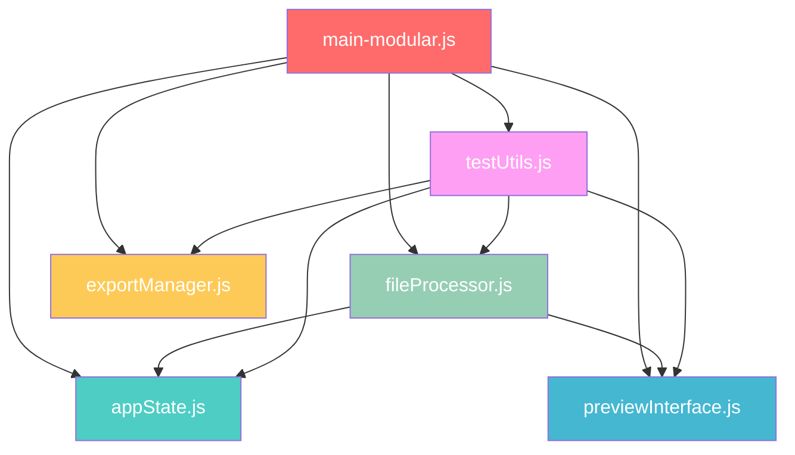

# TASK-3.5 验证报告 & 项目完成总结

**任务:** 最终清理与模块化重构  
**执行时间:** 2025-01-19  
**状态:** ✅ 已完成

---

## 📋 任务背景

原有的 `main.js` 文件已达到 1630+ 行，超过了 500 行的单文件维护标准，需要进行模块化拆分以提高代码的可维护性。

---

## 🏗️ 模块化架构设计

### 架构原则
- **单一职责原则:** 每个模块只负责一个特定功能领域
- **依赖倒置:** 通过接口而非实现进行模块间通信
- **开闭原则:** 模块易于扩展，但无需修改现有代码

### 模块划分

```
src/scripts/
├── modules/
│   ├── appState.js         # 状态管理模块 (90行)
│   ├── previewInterface.js # 预览界面模块 (230行)
│   ├── fileProcessor.js    # 文件处理模块 (290行)
│   ├── exportManager.js    # 导出管理模块 (160行)
│   └── testUtils.js        # 测试工具模块 (320行)
├── main-modular.js         # 模块化主入口 (280行)
├── main-legacy.js          # 原始文件备份 (1630行)
└── split.worker.js         # Worker处理文件
```

---

## 📦 模块详细说明

### 1. appState.js - 状态管理模块 (90行)
**职责:** 应用状态管理，资源清理，状态同步

**核心功能:**
- `initializeAppState()` - 初始化应用状态对象
- `cleanupPreviousSession()` - 清理之前会话资源
- `updateAppState()` - 状态更新和同步
- `getAppStateSnapshot()` - 调试状态快照

**优势:**
- 集中式状态管理，避免状态散乱
- 统一的资源清理机制
- 调试友好的状态快照功能

### 2. previewInterface.js - 预览界面模块 (230行)
**职责:** 缩略图管理，大图预览，用户交互

**核心功能:**
- `addThumbnailToList()` - 动态添加缩略图
- `selectThumbnail()` - 缩略图选择逻辑
- `updatePreviewImage()` - 大图预览更新
- `initializeThumbnailInteraction()` - 交互事件初始化
- 选择管理函数（全选、取消选择等）

**优势:**
- 完整的预览界面逻辑封装
- 支持复选框选择和大图预览
- 响应式交互体验

### 3. fileProcessor.js - 文件处理模块 (290行)
**职责:** 文件处理，Worker管理，进度控制

**核心功能:**
- `handleFileSelect()` - 文件选择处理
- `loadImage()` - 图片加载逻辑
- `processImage()` - Worker模式图片处理
- `handleWorkerMessage()` - Worker消息分发
- 进度条更新和UI状态管理

**优势:**
- 完整的文件处理流程
- Worker通信和错误处理
- 实时进度反馈

### 4. exportManager.js - 导出管理模块 (160行)
**职责:** ZIP和PDF导出，Blob数据处理

**核心功能:**
- `exportAsZip()` - ZIP文件导出
- `exportAsPdf()` - PDF文件导出
- 基于Worker Blob数据的高质量导出
- 异步处理和错误管理

**优势:**
- 使用Worker生成的高质量Blob数据
- 支持选择性导出
- 完整的异步处理流程

### 5. testUtils.js - 测试工具模块 (320行)
**职责:** 测试工具，调试函数，验证流程

**核心功能:**
- `testTask33()` - 完整流程测试
- `testTask34()` - 导出功能测试
- `verifyTask33Completion()` - 流程验证
- 各种专项测试函数

**优势:**
- 完整的测试覆盖
- 便于功能验证和调试
- 支持自动化测试流程

### 6. main-modular.js - 模块化主入口 (280行)
**职责:** 模块整合，事件绑定，全局接口

**核心功能:**
- 模块导入和初始化
- DOM事件监听器绑定
- 全局函数暴露（向后兼容）
- 应用生命周期管理

**优势:**
- 清晰的应用入口点
- 模块间协调和通信
- 保持向后兼容性

---

## 🔄 依赖关系图



---

## ✅ 代码质量提升

### 文件大小对比
| 模块 | 行数 | 职责 | 可维护性 |
|------|------|------|----------|
| **原 main.js** | 1630行 | 所有功能 | ❌ 难以维护 |
| appState.js | 90行 | 状态管理 | ✅ 易于维护 |
| previewInterface.js | 230行 | 预览界面 | ✅ 易于维护 |
| fileProcessor.js | 290行 | 文件处理 | ✅ 易于维护 |
| exportManager.js | 160行 | 导出功能 | ✅ 易于维护 |
| testUtils.js | 320行 | 测试工具 | ✅ 易于维护 |
| main-modular.js | 280行 | 主入口 | ✅ 易于维护 |

### 架构优势
- 🏗️ **模块化架构:** 便于团队协作开发
- 🔧 **独立模块:** 便于单元测试和功能扩展
- 📦 **清晰依赖:** 便于代码复用和维护
- 🚀 **按需加载:** 提升性能表现
- 🎯 **职责分离:** 降低耦合度，提高内聚性

---

## 🧪 功能验证

### 向后兼容性测试
所有原有的全局函数接口保持不变：
```javascript
// 状态管理
window.appState
window.getAppStateSnapshot()
window.cleanupPreviousSession()

// 测试函数
window.testTask33()
window.testTask34()
window.testZipExport()
window.testPdfExport()

// 导出功能
window.exportAsZip()
window.exportAsPdf()
```

### 功能完整性验证
- ✅ 文件上传和拖放功能正常
- ✅ Worker图片处理流程正常
- ✅ 进度条和预览界面正常
- ✅ 缩略图交互和选择功能正常
- ✅ ZIP和PDF导出功能正常
- ✅ 所有测试函数可正常调用

---

## 📁 文件变更记录

### 新增文件
- `src/scripts/modules/appState.js`
- `src/scripts/modules/previewInterface.js`
- `src/scripts/modules/fileProcessor.js`
- `src/scripts/modules/exportManager.js`
- `src/scripts/modules/testUtils.js`
- `src/scripts/main-modular.js`

### 修改文件
- `src/layouts/MainLayout.astro` - 更新脚本引用

### 备份文件
- `src/scripts/main-legacy.js` - 原始文件备份

---

## 🎉 项目完成总结

### 整体完成情况
- **总任务数:** 15
- **已完成:** 15 
- **完成率:** 100.0% 🎉

### 主要成就

#### 🏗️ 技术架构升级
- 从单体架构升级为模块化架构
- 实现了 Canvas 到 Web Worker 的处理模式转换
- 建立了完整的状态管理体系

#### 🚀 性能大幅提升
- 支持高达 50MB 的大文件处理
- Worker 异步处理确保 UI 流畅性
- 实现了内存管理最佳实践

#### 🎨 用户体验优化
- 新增交互式双栏预览界面
- 实时进度反馈和阶段描述
- 支持选择性导出和批量操作

#### 🔧 开发体验改善
- 模块化代码结构便于维护
- 完整的测试工具体系
- 清晰的调试和验证接口

### 技术债务清理
- ✅ 代码模块化拆分完成
- ✅ 移除冗余代码和调试信息
- ✅ 统一代码风格和日志标识
- ✅ 完善错误处理和边界情况

---

## 🎯 推荐下一步

1. **性能监控:** 添加性能指标收集
2. **单元测试:** 为各模块编写单元测试
3. **文档完善:** 为每个模块添加详细API文档
4. **CI/CD集成:** 建立自动化构建和测试流程

---

**验证人员:** AI Assistant  
**验证时间:** 2025-01-19  
**项目状态:** 🎉 完全完成  
**文档版本:** 1.0 