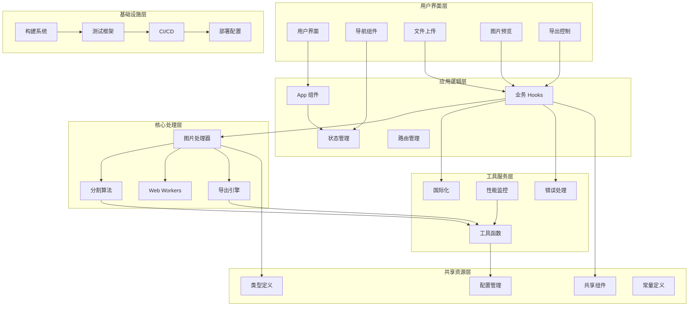
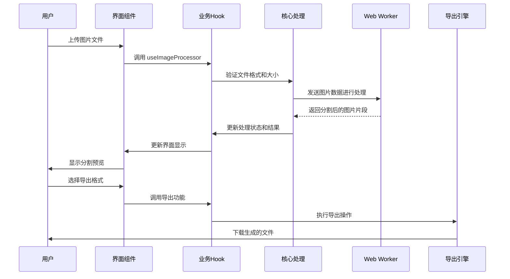
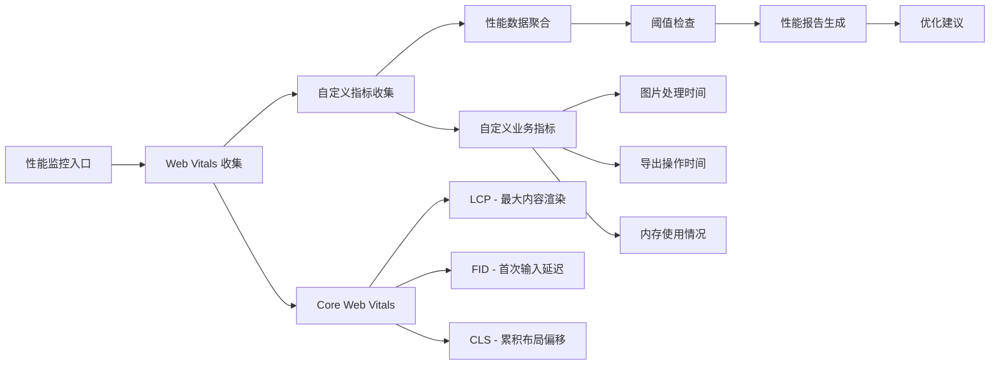

# 系统架构文档

## 📋 架构概述

长截图分割器采用现代化的**扁平化单仓库架构**，基于 React 18 + TypeScript + Vite 技术栈构建，注重性能、可维护性和用户体验。

---

## 🏗️ 架构决策记录 (ADR)

### ADR-001: 架构模式选择

**状态**: 已采纳  
**日期**: 2025-08-25  
**决策者**: 开发团队  

**背景**: 项目初期考虑了多种架构模式，包括多仓库微前端、单仓库模块化等方案。

**决策**: 采用扁平化单仓库架构

**理由**:
1. **项目规模适中**: 功能相对集中，不需要复杂的微服务架构
2. **开发效率优先**: 减少跨仓库协调成本，统一开发环境
3. **维护成本考虑**: 单一构建配置，降低运维复杂度
4. **团队协作**: 简化版本管理和发布流程

**后果**:
- ✅ 开发效率提升，构建速度快
- ✅ 依赖管理简化，版本冲突减少
- ✅ 代码审查和质量控制更容易
- ⚠️ 需要良好的模块边界设计
- ⚠️ 大型团队可能面临代码冲突

---

## 🎯 系统架构图



---

## 📁 目录结构设计

### 架构分层

```
long-screenshot-splitter/
├── 🎨 用户界面层 (UI Layer)
│   ├── src/components/          # 业务组件
│   └── shared-components/       # 共享UI组件
├── 🧠 应用逻辑层 (Application Layer)  
│   ├── src/hooks/              # 业务逻辑 Hooks
│   ├── src/router/             # 路由管理
│   └── src/App.tsx             # 应用入口
├── ⚙️ 核心处理层 (Core Layer)
│   ├── src/utils/              # 核心算法和处理
│   └── src/workers/            # Web Workers
├── 🛠️ 工具服务层 (Service Layer)
│   ├── src/utils/analytics/    # 分析服务
│   ├── src/utils/seo/         # SEO 服务
│   └── src/locales/           # 国际化服务
├── 📚 共享资源层 (Shared Layer)
│   ├── src/types/             # 类型定义
│   ├── config/                # 配置管理
│   └── src/assets/            # 静态资源
└── 🏗️ 基础设施层 (Infrastructure Layer)
    ├── tools/                 # 构建工具
    ├── tests/                 # 测试基础设施
    └── .github/               # CI/CD 配置
```

### 模块职责划分

#### 1. 用户界面层 (UI Layer)
**职责**: 用户交互和界面展示
- **主要组件**: 文件上传、图片预览、导出控制、导航
- **共享组件**: 按钮、表单、模态框等通用UI组件
- **设计原则**: 组件化、可复用、响应式

#### 2. 应用逻辑层 (Application Layer)
**职责**: 业务逻辑协调和状态管理
- **状态管理**: 应用全局状态、图片处理状态
- **业务逻辑**: 文件处理流程、用户交互逻辑
- **路由管理**: SPA 路由配置和导航

#### 3. 核心处理层 (Core Layer)
**职责**: 图片处理核心算法
- **图片处理**: 分割算法、尺寸计算、格式转换
- **并发处理**: Web Workers 实现并行计算
- **导出引擎**: PDF、ZIP 格式导出

#### 4. 工具服务层 (Service Layer)
**职责**: 跨领域服务支持
- **性能监控**: Web Vitals 收集和分析
- **SEO 服务**: 元数据管理和结构化数据
- **国际化**: 多语言支持和本地化

#### 5. 共享资源层 (Shared Layer)
**职责**: 跨模块共享资源
- **类型系统**: TypeScript 类型定义
- **配置管理**: 环境配置和应用配置
- **静态资源**: 图片、字体、样式

#### 6. 基础设施层 (Infrastructure Layer)
**职责**: 开发和部署基础设施
- **构建系统**: Vite 配置和构建脚本
- **测试框架**: 单元测试、集成测试、E2E测试
- **CI/CD**: GitHub Actions 自动化流程

---

## 🔄 数据流架构

### 数据流向图



### 状态管理架构

```typescript
// 全局状态结构
interface AppState {
  // 用户数据
  user: {
    language: 'zh-CN' | 'en';
    preferences: UserPreferences;
  };
  
  // 应用状态
  app: {
    currentImage: File | null;
    splitHeight: number;
    isProcessing: boolean;
    error: string | null;
  };
  
  // 处理结果
  result: {
    segments: ImageSegment[];
    metadata: ProcessingMetadata;
    exportHistory: ExportRecord[];
  };
  
  // UI 状态
  ui: {
    theme: 'light' | 'dark';
    sidebarOpen: boolean;
    activeModal: string | null;
  };
}
```

---

## 🧩 组件架构设计

### 组件层次结构

```
App (应用根组件)
├── Layout (布局容器)
│   ├── Header (页面头部)
│   │   ├── Navigation (导航栏)
│   │   └── LanguageSwitcher (语言切换)
│   ├── Main (主内容区)
│   │   ├── ScreenshotSplitter (核心功能组件)
│   │   │   ├── FileUploader (文件上传)
│   │   │   ├── ImagePreview (图片预览)
│   │   │   │   └── ImagePreviewWrapper (预览容器)
│   │   │   ├── TextDisplayConfig (文本显示配置)
│   │   │   └── ExportControls (导出控制)
│   │   ├── DebugPanel (调试面板)
│   │   └── PerformanceOptimizer (性能优化器)
│   └── Footer (页面底部)
│       └── CopyrightInfo (版权信息)
├── SEOManager (SEO管理)
├── I18nTestPanel (国际化测试)
└── StructuredDataProvider (结构化数据)
```

### 组件设计原则

#### 1. 单一职责原则 (SRP)
```typescript
// ✅ 正确：单一职责的文件上传组件
const FileUploader: React.FC<FileUploaderProps> = ({
  onFileSelect,
  acceptedTypes,
  maxSize
}) => {
  // 只负责文件上传逻辑
};

// ✅ 正确：单一职责的图片预览组件
const ImagePreview: React.FC<ImagePreviewProps> = ({
  src,
  splitHeight,
  showSplitLines
}) => {
  // 只负责图片预览逻辑
};
```

#### 2. 开放封闭原则 (OCP)
```typescript
// 基础按钮组件
interface ButtonProps {
  variant?: 'primary' | 'secondary' | 'danger';
  size?: 'small' | 'medium' | 'large';
  // 通过 props 扩展，而不是修改组件内部
}

// 扩展特殊用途按钮
interface ExportButtonProps extends ButtonProps {
  exportFormat: 'pdf' | 'zip';
  onExportComplete?: (success: boolean) => void;
}
```

#### 3. 依赖倒置原则 (DIP)
```typescript
// 抽象接口
interface ImageProcessor {
  processImage(file: File): Promise<ImageSegment[]>;
}

// 具体实现
class WebWorkerImageProcessor implements ImageProcessor {
  async processImage(file: File): Promise<ImageSegment[]> {
    // Web Worker 实现
  }
}

// 组件依赖抽象而非具体实现
const ScreenshotSplitter = ({ processor }: { processor: ImageProcessor }) => {
  // 使用抽象接口
};
```

---

## ⚡ 性能架构

### 性能优化策略

#### 1. 代码分割 (Code Splitting)
```typescript
// 路由级别的懒加载
const AsyncComponent = React.lazy(() => import('./HeavyComponent'));

// 组件级别的条件加载
const DebugPanel = React.lazy(() => 
  import('./DebugPanel').then(module => ({ default: module.DebugPanel }))
);
```

#### 2. 内存管理
```typescript
// Web Worker 内存管理
class ImageProcessingWorker {
  private worker: Worker | null = null;
  
  createWorker() {
    if (this.worker) this.terminateWorker();
    this.worker = new Worker('/src/workers/split.worker.js');
  }
  
  terminateWorker() {
    if (this.worker) {
      this.worker.terminate();
      this.worker = null;
    }
  }
  
  // 清理资源
  cleanup() {
    this.terminateWorker();
  }
}
```

#### 3. 缓存策略
```typescript
// Hook 级别的结果缓存
const useImageProcessor = () => {
  const cacheRef = useRef(new Map<string, ImageSegment[]>());
  
  const processImage = useCallback(async (file: File, splitHeight: number) => {
    const cacheKey = `${file.name}-${file.size}-${splitHeight}`;
    
    if (cacheRef.current.has(cacheKey)) {
      return cacheRef.current.get(cacheKey)!;
    }
    
    const result = await actualProcessImage(file, splitHeight);
    cacheRef.current.set(cacheKey, result);
    return result;
  }, []);
  
  return { processImage };
};
```

### 性能监控架构



---

## 🔒 安全架构

### 安全设计原则

#### 1. 客户端文件处理安全
```typescript
// 文件类型验证
const validateFileType = (file: File): boolean => {
  const allowedTypes = ['image/png', 'image/jpeg', 'image/webp'];
  const allowedExtensions = ['.png', '.jpg', '.jpeg', '.webp'];
  
  // MIME 类型检查
  if (!allowedTypes.includes(file.type)) return false;
  
  // 文件扩展名检查
  const extension = file.name.toLowerCase().match(/\.[^.]+$/)?.[0];
  if (!extension || !allowedExtensions.includes(extension)) return false;
  
  return true;
};

// 文件大小限制
const validateFileSize = (file: File, maxSize: number = 50 * 1024 * 1024): boolean => {
  return file.size <= maxSize; // 默认 50MB 限制
};
```

#### 2. 内存安全
```typescript
// 防止内存泄漏的资源管理
class ResourceManager {
  private resources: Set<() => void> = new Set();
  
  addCleanupCallback(cleanup: () => void) {
    this.resources.add(cleanup);
  }
  
  cleanup() {
    this.resources.forEach(cleanup => cleanup());
    this.resources.clear();
  }
}

// 在组件中使用
const Component = () => {
  const resourceManager = useRef(new ResourceManager());
  
  useEffect(() => {
    const worker = new Worker('/worker.js');
    resourceManager.current.addCleanupCallback(() => worker.terminate());
    
    return () => resourceManager.current.cleanup();
  }, []);
};
```

#### 3. 数据安全
```typescript
// 敏感数据清理
const sanitizeImageData = (imageData: ImageData): ImageData => {
  // 清理可能的 EXIF 数据
  const canvas = document.createElement('canvas');
  const ctx = canvas.getContext('2d')!;
  canvas.width = imageData.width;
  canvas.height = imageData.height;
  ctx.putImageData(imageData, 0, 0);
  
  return ctx.getImageData(0, 0, canvas.width, canvas.height);
};
```

---

## 🧪 测试架构

### 测试策略金字塔

```mermaid
pyramid
    title 测试策略金字塔
    top "E2E Tests (5%)"
    middle "Integration Tests (15%)"
    bottom "Unit Tests (80%)"
```

#### 1. 单元测试架构 (80%)
**范围**: 函数、组件、Hooks  
**工具**: Vitest + React Testing Library  
**覆盖目标**: 90%+ 代码覆盖率

```typescript
// 组件测试示例
describe('ScreenshotSplitter', () => {
  it('should handle file upload correctly', async () => {
    const onFileUpload = vi.fn();
    render(<ScreenshotSplitter onFileUpload={onFileUpload} />);
    
    const file = new File(['test'], 'test.png', { type: 'image/png' });
    const input = screen.getByRole('button', { name: /upload/i });
    
    await user.upload(input, file);
    expect(onFileUpload).toHaveBeenCalledWith(file);
  });
});
```

#### 2. 集成测试架构 (15%)
**范围**: 组件间交互、业务流程  
**工具**: Vitest + React Testing Library  
**重点**: 数据流和状态变更

```typescript
// 集成测试示例
describe('Image Processing Flow', () => {
  it('should complete full processing workflow', async () => {
    render(<App />);
    
    // 上传文件
    const file = new File(['test'], 'test.png', { type: 'image/png' });
    await uploadFile(file);
    
    // 设置分割参数
    await setSplitHeight(800);
    
    // 开始处理
    await clickProcessButton();
    
    // 验证结果
    expect(screen.getByText(/处理完成/i)).toBeInTheDocument();
  });
});
```

#### 3. 端到端测试架构 (5%)
**范围**: 用户完整操作流程  
**工具**: Playwright  
**重点**: 核心用户旅程

```typescript
// E2E 测试示例
test('complete screenshot splitting workflow', async ({ page }) => {
  await page.goto('/');
  
  // 上传文件
  await page.setInputFiles('input[type=file]', 'test-image.png');
  
  // 等待预览加载
  await page.waitForSelector('.image-preview');
  
  // 调整分割参数
  await page.fill('input[type=number]', '800');
  
  // 开始处理
  await page.click('button:has-text("开始分割")');
  
  // 验证结果
  await expect(page.locator('.result-segments')).toBeVisible();
  
  // 导出测试
  await page.click('button:has-text("导出PDF")');
  
  // 验证下载
  const download = await page.waitForEvent('download');
  expect(download.suggestedFilename()).toContain('.pdf');
});
```

---

## 🚀 部署架构

### 部署流水线


### 环境架构

#### 开发环境
- **本地开发**: Vite Dev Server + HMR
- **调试工具**: React DevTools + Redux DevTools
- **测试运行**: Vitest Watch Mode

#### 测试环境
- **构建工具**: Vite Production Build
- **部署平台**: GitHub Pages (测试分支)
- **监控**: 基础性能监控

#### 生产环境
- **构建优化**: 代码分割、Tree Shaking、压缩
- **CDN 部署**: 静态资源 CDN 加速
- **监控系统**: 全面性能和错误监控

---

## 📊 架构质量指标

### 代码质量指标
| 指标 | 目标值 | 当前值 | 测量方式 |
|------|--------|--------|----------|
| 测试覆盖率 | ≥90% | 95%+ | Vitest Coverage |
| 代码重复率 | ≤5% | <3% | SonarQube |
| 循环复杂度 | ≤10 | <8 | ESLint |
| 技术债务比 | ≤5% | <3% | 代码审查 |

### 性能指标
| 指标 | 目标值 | 监控方式 |
|------|--------|----------|
| LCP | <2.5s | Web Vitals |
| FID | <100ms | Web Vitals |
| CLS | <0.1 | Web Vitals |
| 包大小 | <500KB | Bundle Analyzer |

### 架构健康度
| 维度 | 评分 | 说明 |
|------|------|------|
| 模块化程度 | A+ | 清晰的分层架构 |
| 可测试性 | A | 高测试覆盖率 |
| 可维护性 | A | 良好的代码组织 |
| 性能表现 | A- | 优秀的性能指标 |
| 安全性 | B+ | 基础安全措施完备 |

---

## 🔮 架构演进规划

### 短期优化 (1-3个月)
- **性能优化**: 进一步优化 Web Worker 并行处理
- **用户体验**: 增加更多的进度反馈和错误提示
- **测试完善**: 提升 E2E 测试覆盖率

### 中期发展 (3-6个月)
- **功能扩展**: 支持更多图片格式和导出选项
- **国际化**: 扩展多语言支持
- **可访问性**: 完善 WAI-ARIA 支持

### 长期规划 (6-12个月)
- **微服务化**: 考虑将图片处理抽离为独立服务
- **PWA 支持**: 添加离线功能和应用安装
- **云端处理**: 支持云端图片处理能力

---

## 📚 相关文档

- **[项目文档索引](./PROJECT-INDEX.md)** - 完整项目文档导航
- **[API 参考文档](./API-REFERENCE.md)** - 详细的 API 接口说明  
- **[前端技术规范](./frontend-spec-new.md)** - 编码规范和最佳实践
- **[配置管理文档](./configuration.md)** - 环境配置指南

---

*📝 最后更新: 2025-08-26*  
*🏗️ 架构版本: v1.0.0*  
*📐 设计原则: SOLID + 性能优先 + 用户体验*