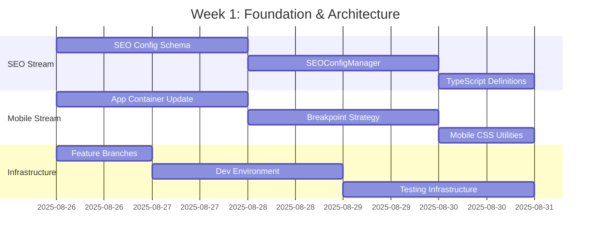
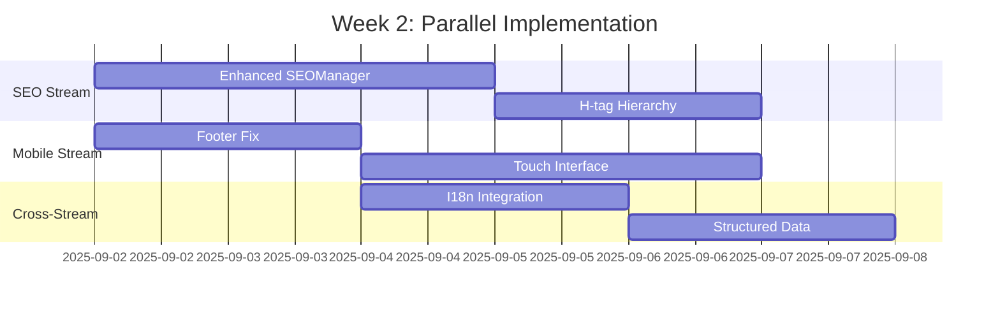
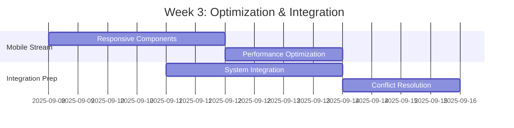
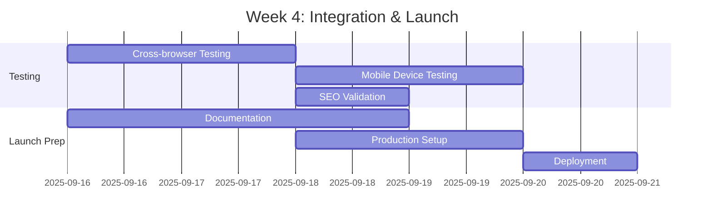

# SEO & Mobile Optimization Implementation Roadmap

## 🚀 Executive Summary

**Project**: Long Screenshot Splitter SEO & Mobile Optimization  
**Strategy**: Agile with intelligent delegation and parallel execution  
**Duration**: 3-4 weeks (20 working days)  
**Team Structure**: Multi-persona coordination with specialized MCP routing  

---

## 📅 Sprint Timeline & Execution Strategy

### Week 1: Foundation & Architecture


### Week 2: Parallel SEO & Mobile Implementation


### Week 3: Optimization & Integration Prep


### Week 4: Final Integration & Launch


---

## 👥 Daily Delegation & Coordination Strategy

### Monday: Sprint Planning & Architecture
**Primary Personas**: Architect, DevOps  
**MCP Servers**: Sequential, Context7  
**Focus**: Sprint planning, architecture decisions, infrastructure setup

### Tuesday-Wednesday: Core Implementation
**Primary Personas**: Frontend Developer, Backend Architect  
**MCP Servers**: Magic, Context7, Sequential  
**Focus**: Component development, feature implementation

### Thursday: Integration & Optimization
**Primary Personas**: Performance Engineer, QA  
**MCP Servers**: Sequential, Playwright  
**Focus**: Performance tuning, testing, integration

### Friday: Validation & Sprint Review
**Primary Personas**: QA Lead, Product Owner  
**MCP Servers**: Playwright, Sequential  
**Focus**: Quality validation, sprint review, next sprint planning

---

## 🔄 Parallel Stream Coordination

### Stream Synchronization Points
1. **Day 3**: Architecture validation checkpoint
2. **Day 8**: Mid-sprint integration review
3. **Day 13**: Pre-integration system sync
4. **Day 18**: Final integration testing
5. **Day 20**: Production deployment

### Conflict Resolution Protocol
1. **Technical Conflicts**: Architect persona + Sequential MCP
2. **Performance Issues**: Performance Engineer + Playwright MCP
3. **Integration Problems**: DevOps + Sequential MCP
4. **Quality Concerns**: QA Lead + Playwright + Sequential MCP

---

## 📋 Task Execution Matrix

### Sprint 1 Tasks (Days 1-5)
| Day | SEO Stream | Mobile Stream | Infrastructure |
|-----|-----------|---------------|----------------|
| 1 | Config Schema Design | App Container Analysis | Feature Branch Setup |
| 2 | SEOConfigManager Core | Breakpoint Strategy | Dev Environment Config |
| 3 | Config Validation | Mobile CSS Foundation | Testing Infrastructure |
| 4 | TypeScript Definitions | Viewport Detection | CI/CD Pipeline |
| 5 | Sprint 1 Validation | Sprint 1 Validation | Sprint 1 Review |

### Sprint 2 Tasks (Days 6-10)
| Day | SEO Stream | Mobile Stream | Cross-Stream |
|-----|-----------|---------------|--------------|
| 6 | SEOManager Enhancement | Footer Component Design | - |
| 7 | Meta Tag Injection | Copyright Info Update | I18n Planning |
| 8 | React Helmet Integration | Touch Target Optimization | I18n Implementation |
| 9 | H-tag Hierarchy System | Touch Feedback | Structured Data |
| 10 | Sprint 2 Validation | Sprint 2 Validation | Cross-validation |

### Sprint 3 Tasks (Days 11-15)
| Day | Focus Area | Primary Tasks | Validation |
|-----|-----------|---------------|------------|
| 11 | Responsive Components | FileUploader, Buttons, Grid | Component Testing |
| 12 | Performance Optimization | Lazy Loading, Virtual Scroll | Performance Testing |
| 13 | System Integration | Stream Merging, Conflict Resolution | Integration Testing |
| 14 | Cross-platform Testing | iOS, Android, Desktop | Device Testing |
| 15 | Sprint 3 Review | Quality Gates, Performance Metrics | Comprehensive Review |

### Sprint 4 Tasks (Days 16-20)
| Day | Focus Area | Primary Tasks | Deliverable |
|-----|-----------|---------------|-------------|
| 16 | Final Integration | System Consolidation | Integrated System |
| 17 | Comprehensive Testing | End-to-end, Cross-browser | Test Reports |
| 18 | SEO & Performance Validation | Lighthouse, Core Web Vitals | Performance Report |
| 19 | Documentation & Training | Guides, Training Materials | Complete Documentation |
| 20 | Production Deployment | Environment Setup, Go-Live | Live System |

---

## 🎯 Quality Gates & Checkpoints

### Daily Checkpoints
- **Morning Standup**: Progress review, blocker identification
- **Midday Sync**: Cross-stream coordination, dependency management
- **End-of-Day Review**: Task completion, next-day planning

### Sprint Checkpoints
- **Sprint 1**: Architecture validation, environment readiness
- **Sprint 2**: SEO functionality, mobile foundation
- **Sprint 3**: Integration readiness, performance optimization
- **Sprint 4**: Production readiness, launch preparation

### Quality Metrics Dashboard
```
SEO Metrics:
├── Lighthouse SEO Score: Target ≥90
├── Meta Tag Coverage: Target 100%
├── H-tag Hierarchy: Target Valid
└── Structured Data: Target Valid

Mobile Metrics:
├── Touch Target Size: Target ≥44px
├── Viewport Compatibility: Target 100%
├── Performance Score: Target ≥85
└── Core Web Vitals: Target Green

Integration Metrics:
├── Test Coverage: Target ≥90%
├── Cross-browser Compatibility: Target 100%
├── Performance Budget: Target <3s load
└── Zero Regressions: Target 100%
```

---

## 🚨 Risk Mitigation & Contingency Planning

### High-Risk Areas
1. **SEO-Mobile Integration Conflicts**: Daily sync, shared config
2. **Performance Degradation**: Continuous monitoring, performance budgets
3. **Cross-browser Compatibility**: Early testing, graceful degradation
4. **Mobile Device Fragmentation**: Device testing matrix, responsive design

### Contingency Actions
- **Behind Schedule**: Reduce scope, focus on MVP, extend sprint
- **Technical Blockers**: Escalate to architect, alternative approaches
- **Integration Issues**: Rollback to last stable, incremental integration
- **Quality Concerns**: Additional testing, external review, delayed release

---

## 📊 Success Criteria & Definition of Done

### Epic Success Criteria
- [ ] SEO score improvement ≥20 points
- [ ] Mobile performance meets Core Web Vitals
- [ ] Zero regression in existing functionality
- [ ] Complete documentation and training materials
- [ ] Successful production deployment

### Story Definition of Done
- [ ] All acceptance criteria met
- [ ] Code reviewed and approved
- [ ] Tests written and passing (≥90% coverage)
- [ ] Documentation updated
- [ ] Performance benchmarks met
- [ ] Cross-browser tested
- [ ] Mobile device tested
- [ ] Security reviewed
- [ ] Accessibility validated
- [ ] Production ready

---

## 🔧 Tool & Resource Allocation

### MCP Server Utilization
- **Context7**: Documentation patterns, framework best practices (30% utilization)
- **Sequential**: Complex analysis, systematic problem solving (40% utilization)  
- **Magic**: UI component generation, design systems (25% utilization)
- **Playwright**: Testing automation, performance validation (35% utilization)

### Persona Activation Schedule
- **Week 1**: Architect (80%), DevOps (60%), Frontend (40%)
- **Week 2**: Frontend (90%), SEO Specialist (70%), UX Designer (50%)
- **Week 3**: Performance Engineer (80%), QA (70%), Architect (30%)
- **Week 4**: QA Lead (90%), Tech Writer (60%), Product Owner (50%)

---

## 🎉 Launch Strategy & Post-Implementation

### Deployment Phases
1. **Staging Deployment**: Day 18 - validation in staging environment
2. **Canary Release**: Day 19 - 10% user traffic for validation
3. **Gradual Rollout**: Day 20 - 50% → 100% user traffic
4. **Full Production**: Day 21 - complete rollout with monitoring

### Post-Launch Monitoring
- **Performance Monitoring**: Core Web Vitals, load times
- **SEO Tracking**: Search rankings, crawl errors
- **User Experience**: Mobile usage patterns, conversion rates
- **Error Monitoring**: JavaScript errors, API failures

### Success Metrics Tracking
- **Week 1**: Baseline metrics collection
- **Week 2**: Initial improvement measurement  
- **Week 4**: Final impact assessment
- **Month 1**: Long-term performance validation

---

*Implementation roadmap created with agile strategy and intelligent delegation*  
*Document Version: 1.0 | Created: 2025-08-26*