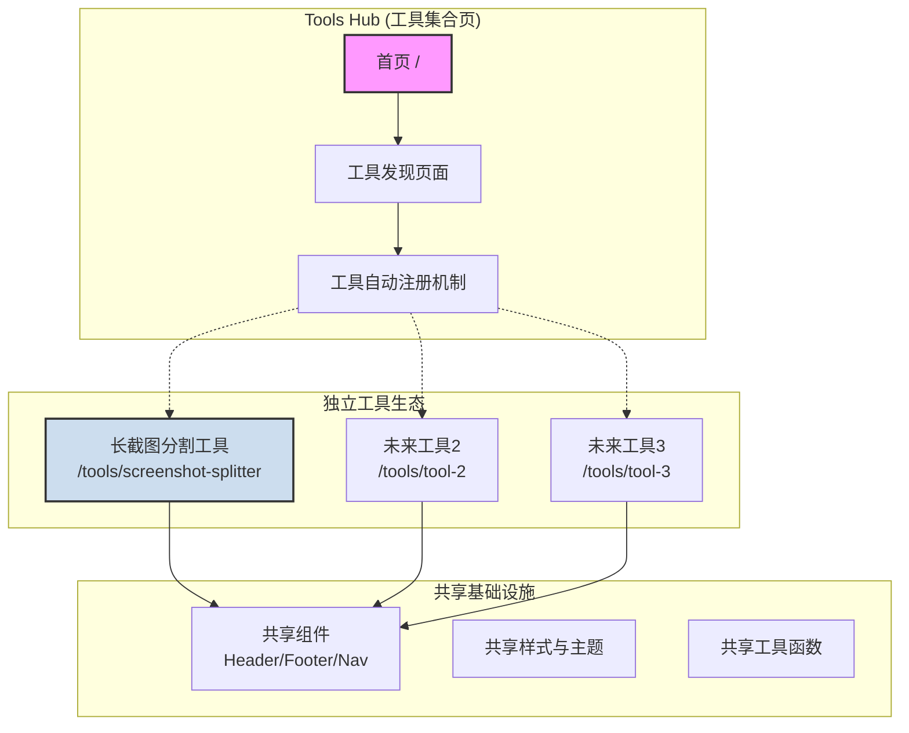
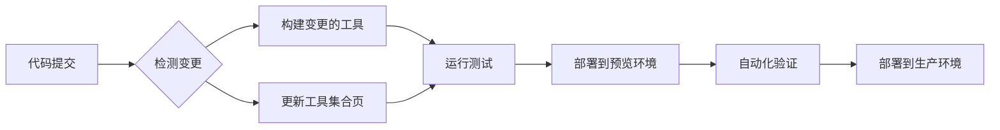

# Product Requirements Document (PRD): "BrowserCraft Tools"

---

**文档版本:** 1.0
**发布日期:** 2023-10-27
**作者:** Gemini (Product Manager & SEO Expert)

---

## 1. 产品概述 (Product Overview)

### 1.1. 产品愿景 (Vision)

构建一个**模块化、可扩展的浏览器工具生态系统**。核心理念是"**一个入口，多个独立工具**"——通过统一的工具集合页面作为入口，但每个工具都可以独立开发、独立部署、独立使用。所有工具都基于浏览器本地运算，确保用户数据的**绝对隐私和安全**。

**设计哲学**: 
- **统一入口**: 提供一个工具集合页面，方便用户发现和访问所有工具
- **独立开发**: 每个工具都是独立的应用，可以单独迭代和部署  
- **共享基础**: 公共组件(Header、Footer、Navigation)统一管理，降低维护成本
- **灵活部署**: 支持工具集整体部署，也支持单个工具的独立部署

### 1.2. 核心价值主张 (Core Value Proposition)

*   **绝对隐私**: 你的文件，只属于你。我们从不、也永远不会将你的数据上传到云端。
*   **即开即用**: 无需注册，没有广告干扰，打开网页即可立即使用。
*   **极致性能**: 借助现代浏览器技术，复杂任务也能在数秒内完成，无需等待。
*   **离线可用**: 核心工具支持离线使用，让你在任何网络环境下都能高效工作。

### 1.3. 目标用户 (Target Audience)

**主要用户**: 开发者自己及有类似需求的用户群体

**用户特征**:
*   **注重隐私**: 不希望将敏感文件上传到未知服务器
*   **追求效率**: 需要快速、简洁的工具来完成特定任务  
*   **技术敏感**: 理解并欣赏"浏览器本地处理"的技术优势
*   **工具导向**: 更关注功能实用性而非花哨界面

**典型使用场景**:
*   处理长截图用于社交媒体发布
*   在离线或受限网络环境下使用工具
*   处理包含敏感信息的文件(如工作截图、私人照片)

### 1.4. 项目目标 (Project Goals)

**短期目标 (3个月内)**:
*   完成长截图分割工具的开发和部署
*   建立工具集合页面的基础框架
*   验证独立工具的自动注册和集成机制

**中期目标 (6-12个月内)**:  
*   开发2-3个新工具，验证架构的可扩展性
*   完善工具的独立部署和离线使用能力
*   建立稳定的用户群体(主要通过口碑传播)

**长期目标 (1年以上)**:
*   形成一个成熟的工具生态，支持快速添加新工具
*   探索开源社区贡献的可能性
*   考虑商业化或其他可持续发展模式

---

## 2. 核心架构设计 (Core Architecture Design)

### 2.1. 整体架构理念

基于现有的Monorepo架构，设计一个**"统一入口 + 独立工具"**的模块化系统：



### 2.2. 核心设计原则

1. **工具独立性**:
   - 每个工具都是独立的React应用，有自己的路由、状态管理、构建配置
   - 可以单独开发、测试、部署，不影响其他工具
   - 支持CDN资源配置，提高静态资源加载性能

2. **自动化集成**:
   - 新工具通过配置文件自动注册到工具集合页
   - 工具元信息(名称、描述、图标、路由)统一管理
   - 支持工具的启用/禁用状态控制

3. **共享资源管理**:
   - Header、Footer、Navigation等公共组件统一维护
   - 主题、样式、国际化资源共享
   - 公共工具函数和Hooks复用

4. **灵活部署策略**:
   - 支持全量部署(所有工具一起部署)
   - 支持增量部署(只部署变更的工具)  
   - 支持单工具部署(独立域名或子路径)

### 2.3. 工具注册机制

每个工具通过一个配置文件来声明自己的元信息：

```javascript
// packages/screenshot-splitter/tool.config.js
export default {
  id: 'screenshot-splitter',
  name: '长截图分割工具', 
  description: '将超长截图切分为多张标准尺寸图片',
  icon: '/icons/screenshot-splitter.svg',
  route: '/tools/screenshot-splitter',
  category: 'image-processing',
  status: 'active', // active | beta | disabled
  features: ['offline', 'privacy-first', 'no-upload'],
  version: '1.0.0'
}
```

工具集合页面会自动扫描所有工具的配置，生成工具列表和导航。

---

## 3. 网站整体架构与设计

### 3.1. 网站地图 (Sitemap)

```mermaid
graph TD
    A[/, Homepage] --> B[/tools, Tools Hub];
    B --> C[/tools/long-screenshot-splitter, 长截图分割工具];
    B --> D[/tools/image-watermarker, 图片加水印工具 (未来)];
    B --> E[/tools/svg-to-png-converter, SVG转PNG工具 (未来)];
    A --> F[/about, 关于我们];
    A --> G[/privacy, 隐私政策];
    A --> H[/blog, 博客 (未来)];
```

### 3.2. 通用页面元素 (Common Elements)

*   **页头 (Header)**:
    *   左侧：Logo 和品牌名 "BrowserCraft Tools"。
    *   中间：导航链接（首页、所有工具、关于我们、博客）。
    *   右侧：语言切换器、主题切换（白天/黑夜模式）按钮。
*   **页脚 (Footer)**:
    *   版权信息 (© 2023 BrowserCraft Tools)。
    *   链接：隐私政策、联系我们、GitHub 开源地址。
    *   一句话品牌宣言："在您的浏览器中安全地完成工作"。

### 3.3. 构建和部署策略 (Build & Deployment Strategy)

基于现有的双模式构建系统，扩展支持独立工具的灵活部署：

#### 3.3.1. 构建模式

1. **全量构建 (Full Build)**
   ```bash
   pnpm build:all
   # 构建所有工具 + 工具集合页面
   # 输出: dist/ (构建产物)
   ```

2. **单工具构建 (Individual Tool Build)**  
   ```bash
   pnpm build:tool screenshot-splitter
   # 只构建指定工具，包含共享组件
   # 输出: packages/screenshot-splitter/dist/
   ```

3. **增量构建 (Incremental Build)**
   ```bash
   pnpm build:changed
   # 只构建有变更的工具和依赖它们的工具集合页
   ```

#### 3.3.2. 部署模式

1. **统一部署**: 所有工具部署在同一个域名下
   - 主站: `https://browsercraft.tools/`
   - 工具页: `https://browsercraft.tools/tools/screenshot-splitter`

2. **独立部署**: 单个工具可以部署到独立域名
   - 独立域名: `https://screenshot-splitter.browsercraft.tools/`  
   - 或子目录: `https://mysite.com/tools/screenshot-splitter/`

3. **离线部署**: 单文件版本可以在任何环境使用
   - 下载单个HTML文件
   - 在内网、离线环境中使用

#### 3.3.3. 自动化流程



---

## 4. 功能需求详述 (Functional Requirements)

### 4.1. 首页 / 工具导航页 (`/`)

#### 4.1.1. 产品功能需求

1.  **英雄区域 (Hero Section)**:
    *   **主标题 (H1)**: 应该是一个强有力的价值主张，例如：“**安全、免费、即时的在线工具集**”。
    *   **副标题**: 对主标题的补充说明，例如：“您的所有文件均在浏览器本地处理，无需上传，保护您的数据隐私。”
    *   **视觉元素**: 一个简洁、现代的动画或图形，能抽象地展示“浏览器本地处理”的概念。

2.  **核心优势展示区**:
    *   使用三个卡片或图标，突出展示三大核心价值：
        *   **隐私保护**: “数据不出浏览器，从根源上杜绝隐私泄露。”
        *   **高性能**: “利用设备算力，任务处理无需等待。”
        *   **完全免费**: “所有工具永久免费，无任何隐藏费用。”

3.  **动态工具网格**:
    *   **自动化工具发现**: 页面会自动扫描所有工具的`tool.config.js`文件，生成工具列表
    *   **每个工具卡片包含**:
        *   工具图标 (从配置文件读取)
        *   工具名称和描述 (支持国际化)
        *   功能标签 (offline、privacy-first、no-upload等)
        *   状态标识 (active、beta、disabled)
        *   "立即使用"按钮 (链接到工具页面)
    *   **分类和筛选**:
        *   按类别分组显示 (image-processing、text-tools、dev-tools等)
        *   支持按功能特性筛选 (如只显示支持离线的工具)
    *   **当前可用工具**:
        *   **长截图分割工具** (status: active)
    *   **占位工具** (用于展示扩展能力):
        *   图片加水印工具 (status: disabled, 显示"即将推出")
        *   SVG格式转换工具 (status: disabled, 显示"即将推出")

#### 4.1.2. SEO 优化需求

*   **`<title>` 标签**: `BrowserCraft Tools | 安全、免费的浏览器在线工具集`
*   **Meta Description**: `探索一系列强大、安全且完全免费的在线工具。所有文件处理均在您的浏览器本地完成，无需上传，100%保护您的隐私。`
*   **H1 标签**: `安全、免费、即时的在线工具集`
*   **关键词**: `在线工具`, `免费工具`, `浏览器工具`, `隐私安全`, `截图分割`, `图片处理`。
*   **结构化数据**: 使用 `WebSite` 和 `Service` Schema.org 标记来帮助搜索引擎理解网站和提供的服务。

---

### 4.2. 子页面 / 工具页 (以 `长截图分割工具` 为例)

#### 4.2.1. 产品功能需求

1.  **页面布局**: 采用“上工具，下说明”的经典布局。
    *   **顶部**: 工具主界面，占据首屏主要位置，确保用户一进入页面就能立即开始操作。
    *   **底部**: 关于该工具的详细说明、使用教程、FAQ等。

2.  **工具主界面**:
    *   **文件上传区**:
        *   支持拖拽上传和点击选择文件。
        *   明确标示支持的图片格式（PNG, JPG, WEBP等）。
        *   上传后，主界面切换到处理视图。
    *   **配置与预览区**:
        *   左侧为配置面板，右侧为图片预览。
        *   **配置项**:
            *   分割高度（滑块+输入框）。
            *   输出图片格式（JPG/PNG）。
            *   图片质量（仅当格式为JPG时）。
            *   文件名前缀。
        *   **预览区**:
            *   实时显示分割线和分割后的图片预览。
            *   提供复选框，允许用户选择需要导出的图片。
            *   显示分割后的图片数量和尺寸信息。
    *   **导出操作区**:
        *   “导出选中图片 (ZIP)”
        *   “导出全部图片 (ZIP)”
        *   处理过程中显示进度条，完成后提供下载链接。

3.  **内容说明区 (工具界面下方)**:
    *   **“如何使用”板块**:
        *   用“1-2-3”步骤形式，图文并茂地介绍使用流程。
        *   (1) 上传图片 -> (2) 调整设置 -> (3) 下载结果。
    *   **功能亮点板块**:
        *   强调此工具的独特优势：本地处理、无尺寸限制、高效率、支持多种格式等。
    *   **常见问题 (FAQ) 板块**:
        *   预先回答用户可能遇到的问题。

#### 4.2.2. SEO 优化需求

*   **URL**: `/tools/long-screenshot-splitter`
*   **`<title>` 标签**: `免费长截图分割工具 | 在线将长图/高图分割 - BrowserCraft Tools`
*   **Meta Description**: `轻松在线分割您的长截图或高分辨率图片。我们的免费工具100%在您的浏览器本地运行，无需上传，保证速度与隐私安全。`
*   **H1 标签**: `长截图分割工具`
*   **关键词**: `长截图分割`, `网页长截图`, `图片分割工具`, `在线切图`, `手机长截图`, `Twitter截图`, `Instagram长图`。
*   **内容为王**:
    *   撰写高质量、原创的“如何使用”和“FAQ”内容。
    *   **FAQ示例**:
        *   问：这个工具是免费的吗？
        *   问：我的图片会被上传到服务器吗？
        *   问：如何分割长截图以发布到Instagram Story？
        *   问：我可以处理多大的图片文件？
        *   问：这个工具可以在手机上使用吗？
*   **结构化数据**:
    *   为“如何使用”板块添加 `HowTo` Schema。
    *   为“FAQ”板块添加 `FAQPage` Schema，以争取在搜索结果中获得富文本摘要（Rich Snippet）。
*   **内部链接**: 在内容中自然地链接到首页或其他相关的未来工具。

## 5. 技术实现要点 (Technical Implementation)

### 5.1. 工具自动注册系统

创建一个工具注册系统，支持新工具的自动发现和集成：

```typescript
// tools/registry/ToolRegistry.ts
interface ToolConfig {
  id: string;
  name: string;
  description: string;
  icon: string;
  route: string;
  category: string;
  status: 'active' | 'beta' | 'disabled';
  features: string[];
  version: string;
}

class ToolRegistry {
  // 自动扫描所有packages/*/tool.config.js文件
  static async discoverTools(): Promise<ToolConfig[]> {
    // 实现工具发现逻辑
  }
  
  // 根据状态过滤工具
  static filterByStatus(tools: ToolConfig[], status: string[]): ToolConfig[] {
    // 实现过滤逻辑
  }
}
```

### 5.2. 共享组件架构

设计一套共享组件系统，确保一致性同时支持独立性：

```typescript
// packages/shared-components/src/layout/
export { AppHeader } from './AppHeader';
export { AppFooter } from './AppFooter'; 
export { ToolLayout } from './ToolLayout';

// packages/shared-components/src/providers/
export { ThemeProvider } from './ThemeProvider';
export { I18nProvider } from './I18nProvider';
```

### 5.3. 构建系统扩展

扩展现有的构建脚本，支持新的构建模式：

```javascript
// tools/build-scripts/build-tool.js
async function buildSingleTool(toolId) {
  // 1. 构建工具本身
  // 2. 包含必要的共享组件
  // 3. 生成独立可部署的包
  // 4. 配置CDN资源地址
}

// tools/build-scripts/build-registry.js  
async function updateToolRegistry() {
  // 1. 扫描所有工具配置
  // 2. 生成工具注册表
  // 3. 更新首页的工具列表
}
```

---

## 6. 非功能性需求 (Non-Functional Requirements)

*   **性能**:
    *   全站 Lighthouse 性能得分 > 95。
    *   首次内容绘制 (FCP) < 1.5s。
    *   可交互时间 (TTI) < 2s。
*   **兼容性**: 兼容最新版本的 Chrome, Firefox, Safari, Edge 桌面和移动浏览器。
*   **无障碍 (Accessibility)**:
    *   遵循 WCAG 2.1 AA 标准。
    *   所有功能都可通过键盘操作。
    *   为屏幕阅读器提供良好的支持。
*   **国际化 (i18n)**:
    *   网站内容（包括工具UI和内容板块）应完全可本地化。
    *   初期支持语言：英文、简体中文。
    *   应能根据浏览器 `navigator.language` 自动选择默认语言。

## 7. 开发路线图 (Development Roadmap)

### 7.1. Phase 1: 基础架构搭建 (1-2个月)

**主要目标**: 建立可扩展的工具生态基础

*   **核心任务**:
    *   实现工具自动注册和发现机制
    *   完善共享组件系统 (Header, Footer, Navigation)
    *   扩展构建系统，支持独立工具构建和部署
    *   完成长截图分割工具的优化和完善

*   **交付成果**:
    *   工具集合首页 (自动显示可用工具)
    *   长截图分割工具 (完整功能)
    *   独立构建和部署能力验证
    *   基础文档和使用指南

### 7.2. Phase 2: 生态验证 (2-3个月)

**主要目标**: 验证架构的可扩展性和易用性

*   **核心任务**:
    *   开发第二个工具 (如图片加水印工具)
    *   验证新工具的快速集成流程
    *   完善错误处理和边缘情况
    *   优化移动端体验

*   **交付成果**:
    *   至少2个完整可用的工具
    *   验证的工具开发和部署流程
    *   移动端优化版本
    *   用户反馈收集机制

### 7.3. Phase 3: 生态扩展 (3-6个月)

**主要目标**: 扩展工具种类，建立用户群体

*   **核心任务**:
    *   开发3-5个不同类型的工具
    *   实现PWA支持，完善离线能力
    *   建立用户反馈和需求收集机制
    *   探索开源贡献模式

*   **交付成果**:
    *   丰富的工具生态 (5-8个工具)
    *   PWA版本，支持完整离线使用
    *   稳定的用户群体和反馈循环
    *   开源贡献指南和流程

### 7.4. 长期愿景 (6个月以上)

*   **技术演进**: 探索WebAssembly、AI集成等先进技术
*   **社区建设**: 建立开源社区，接受外部贡献
*   **商业探索**: 探索可持续发展的商业模式
*   **平台化**: 考虑将工具生态平台化，支持第三方开发者
