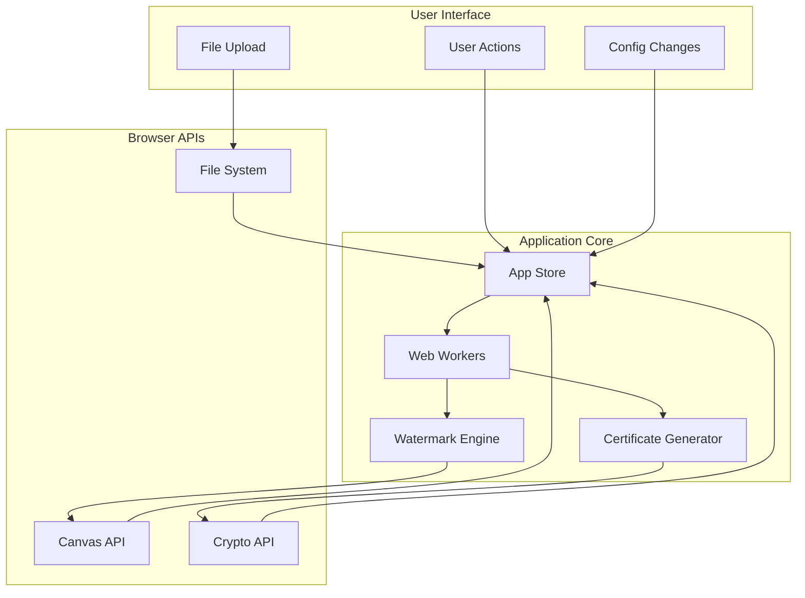

# HydraMark Data Flow Architecture

## Overall Data Flow

## Key Data Flows

### 1. File Processing Flow
- User upload → File validation → Metadata extraction → Store update
- Local file processing only - no network requests

### 2. Watermark Configuration Flow
- User input → Config validation → Store update → Preview regeneration
- Real-time Canvas rendering for instant feedback

### 3. Certificate Generation Flow
- File hash calculation → Timestamp → Digital signature → Certificate storage
- All crypto operations using Web Crypto API

## Performance Optimizations
- Web Worker parallel processing
- Memory-efficient file handling
- Progressive rendering
- Efficient state updates

## Security Measures
- Local processing only
- Secure crypto operations
- No data persistence without consent
- Privacy by design

---
*Data flow architecture ensuring performance and privacy*