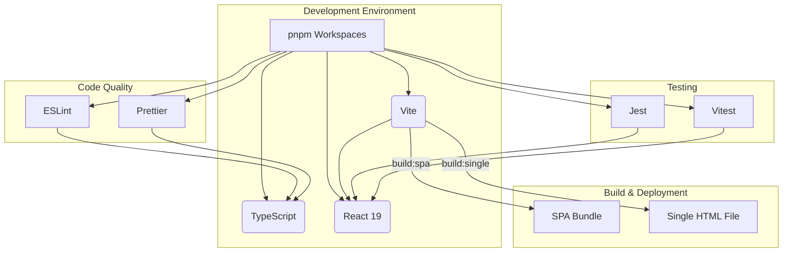

# 文档 02: 技术栈分析 (Tech Stack Analysis)

## 1. 概述

本文档深入分析 `dual-build-monorepo-system` 项目所采用的技术栈。选择合适的技术栈是项目成功的基础，它直接影响到开发效率、应用性能和未来的可扩展性。本项目经过精心选型，旨在打造一个现代化、高效且可维护的前端开发体系。

核心技术栈包括：
*   **UI 框架**: React 19
*   **语言**: TypeScript
*   **构建工具**: Vite
*   **包管理器**: pnpm (with Workspaces)
*   **测试**: Jest & Vitest
*   **代码风格**: ESLint & Prettier

## 2. 架构图

技术栈的协同工作模式可以用下图表示：


这张图清晰地展示了 `pnpm` 如何作为所有工具和库的基石，而 `Vite` 则是连接开发、构建和最终产物的核心枢纽。

## 3. 代码示例

项目的构建逻辑高度可配置，其核心在于 `vite.config.base.js` 和各个包的 `vite.config.ts`。

**文件路径**: `vite.config.base.js`
```javascript
import { defineConfig } from 'vite';
import react from '@vitejs/plugin-react';
import { viteSingleFile } from 'vite-plugin-singlefile';
import { viteExternalsPlugin } from 'vite-plugin-externals';

export function createBaseConfig(options = {}) {
  const { mode = 'spa' } = options;
  const isSingleFile = mode === 'singlefile';

  return defineConfig({
    plugins: [
      react(),
      ...(isSingleFile ? [
        viteExternalsPlugin({ /* ...cdn config... */ }),
        viteSingleFile()
      ] : [])
    ],
    build: {
      // ... build options based on mode
    }
  });
}
```
这段代码是项目双模式构建能力的关键。通过动态加载 `vite-plugin-singlefile` 和 `vite-plugin-externals` 插件，Vite 能够根据 `mode` 参数生成完全不同形态的产物。

## 4. 配置示例

在 `screenshot-splitter` 包中，Vite 配置被进一步扩展，以适应其特定需求。

**文件路径**: `packages/screenshot-splitter/vite.config.ts`
```typescript
import { defineConfig } from 'vite';
import { createBaseConfig } from '../../vite.config.base.js';

export default defineConfig(({ mode }) => {
  const baseConfig = createBaseConfig({
    mode,
    component: 'screenshot-splitter',
    // ... other specific settings
  });

  return baseConfig;
});
```
这种分层配置的方法是 Monorepo 架构中的最佳实践。它将通用逻辑（如双模式构建）沉淀在基础配置中，同时允许每个包根据需要进行独立的定制，实现了配置的“高内聚、低耦合”。

## 5. 最佳实践

*   **统一版本**: 在根 `package.json` 的 `devDependencies` 中锁定核心工具（Vite, TypeScript, ESLint）的版本，确保所有包在一致的环境下开发和构建。
*   **利用 Vite 插件**: 积极利用 Vite 强大的插件生态。例如，使用 `vite-plugin-externals` 在 `singlefile` 模式下剥离大型库（如React），通过 CDN 加载，显著减小最终文件体积。
*   **环境变量**: 通过 `define` 配置项注入构建时环境变量（如 `__BUILD_MODE__`），使应用代码能够感知当前的构建模式，并据此执行不同的逻辑（例如，在 singlefile 模式下禁用某些需要服务器支持的功能）。
*   **路径别名**: 充分利用 `resolve.alias` 来简化跨包导入。这不仅使代码更易读，还解耦了组件的实际文件路径，便于未来重构。

## 6. 案例分析

**场景**: 需要将 `screenshot-splitter` 组件嵌入到一个完全没有前端构建环境的静态网站中。

传统的 SPA 应用无法满足此需求，因为它需要托管 JS 和 CSS 文件。但得益于本项目的技术栈设计，我们可以轻松应对：

1.  **执行构建**: 运行 `pnpm build:screenshot-splitter:single` 命令。
2.  **获取产物**: Vite 会在 `dist-single` 目录下生成一个独立的 `index.html` 文件。
3.  **嵌入使用**:
    *   将这个 HTML 文件的内容直接复制粘贴到目标静态网站的任意位置。
    *   或者，使用 `<iframe>` 标签来加载这个 HTML 文件。

这个案例完美地展示了 `Vite` + `vite-plugin-singlefile` 组合的威力，它为组件的分发和集成提供了极大的灵活性，是该项目技术选型的一大亮点。
