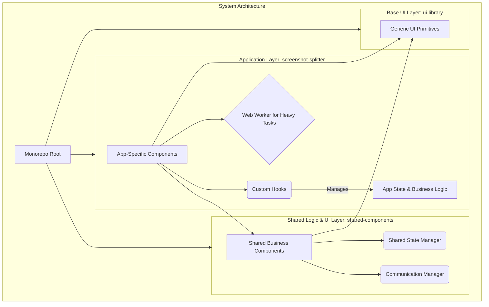

# 文档 03: 系统架构模式 (System Architecture Patterns)

## 1. 概述

本文档阐述了 `dual-build-monorepo-system` 项目所采用的核心系统架构模式。架构模式是经过验证的、可复用的解决方案，用于解决软件设计中反复出现的问题。本项目综合运用了多种现代化前端架构模式，构建了一个可扩展、可维护且高性能的系统。

主要的架构模式包括：
*   **Monorepo 模式**: 用于统一管理多个关联包。
*   **分层组件模式 (Layered Component Pattern)**: 将组件按职责划分为不同层次。
*   **关注点分离模式 (Separation of Concerns)**: 在目录结构和代码组织上的体现。
*   **自定义 Hooks 模式**: 用于封装和复用业务逻辑。
*   **Web Worker 模式**: 用于提升密集型计算任务的性能。

## 2. 架构图

系统的分层架构和关注点分离可以通过以下图表来描述：


该图展示了从底层通用 UI 到顶层应用的清晰分层结构。数据和逻辑流是单向的，上层可以依赖下层，但反之则不行，这保证了系统的低耦合性。

## 3. 代码示例

**Web Worker 模式** 是本项目性能优化的关键。通过将耗时的图像分割任务转移到后台线程，主 UI 线程得以保持流畅。

**文件路径**: `packages/screenshot-splitter/src/hooks/useImageProcessor.ts`
```typescript
// (Simplified Example)
import { useWorker } from './useWorker';

export function useImageProcessor() {
  const { postMessage, result, error } = useWorker('/src/workers/split.worker.js');

  const processImage = (imageData) => {
    // 将任务发送到 Worker，而不是在主线程上执行
    postMessage({ type: 'SPLIT_IMAGE', payload: imageData });
  };

  // 监听来自 Worker 的结果
  useEffect(() => {
    if (result) {
      // 更新UI
    }
  }, [result]);

  return { processImage, result, error };
}
```
`useImageProcessor` 这个自定义 Hook 优雅地封装了与 Web Worker 的交互逻辑，使得组件可以像调用一个普通函数一样来使用后台处理能力，极大地简化了异步编程的复杂性。

## 4. 配置示例

**分层组件模式** 不仅体现在代码上，也体现在项目的路径别名配置中，这为开发者提供了清晰的指引。

**文件路径**: `vite.config.base.js`
```javascript
// ...
export function createBaseConfig(options = {}) {
  // ...
  return defineConfig({
    resolve: {
      alias: {
        '@': resolve(root, 'src'), // 当前应用
        '@shared': resolve(root, '../shared-components/src'), // 共享业务组件
        '@ui': resolve(root, '../ui-library/src'), // 基础UI库
      }
    }
  });
}
```
这个配置为三个核心层级（应用层、共享层、UI层）定义了明确的导入路径。它不仅是技术上的便捷设置，更是一种架构上的约定，引导开发者遵循预设的分层模型，避免了混乱的跨层级依赖。

## 5. 最佳实践

*   **明确各层职责**:
    *   `ui-library`: 只包含无业务逻辑的、样式化的基础组件（如 Button, Input）。
    *   `shared-components`: 组合 `ui-library` 的组件，并封装可被多个应用复用的业务逻辑和状态（如带有数据获取逻辑的 `UserProfileCard`）。
    *   `screenshot-splitter`: 实现具体的应用功能，消费来自下两层的组件。
*   **Hooks 应该保持纯粹**: 自定义 Hooks 应专注于封装一段特定的逻辑，避免在一个 Hook 中处理过多的无关事务。
*   **谨慎使用共享状态**: `shared-components` 中 `SharedStateManager` 是一个强大的工具，但也应谨慎使用。只将真正需要在多个独立应用间共享的状态放入其中，避免造成不必要的耦合。
*   **Worker 通信接口标准化**: 为 Web Worker 定义清晰、一致的消息格式（`{ type, payload }`），并提供类型定义，以减少通信错误。

## 6. 案例分析

**场景**: 未来需要开发一个新的“图片加水印”工具应用，并将其集成到同一个 Monorepo 中。

得益于当前成熟的架构模式，这个新需求的实现过程将非常高效：

1.  **创建新包**: 在 `packages/` 目录下创建一个新的 `watermark-tool` 应用包。
2.  **复用UI和共享组件**: 新的 `watermark-tool` 可以直接通过 `@ui` 和 `@shared` 别名，复用 `ui-library` 的按钮、输入框，以及 `shared-components` 的图片预览器等组件，无需重复开发。
3.  **开发新功能**: 在 `watermark-tool` 内部，开发者可以专注于实现核心的加水印逻辑。如果加水印的过程计算量很大，可以参照 `screenshot-splitter` 的实践，为其创建一个新的 Web Worker。
4.  **构建和部署**: 新的应用可以自动受益于根目录的构建脚本和 Vite 基础配置，轻松实现开发、构建和预览。

这个案例充分说明了当前架构模式的**高扩展性**。通过清晰的分层和关注点分离，系统能够像搭乐高一样，轻松地增加新的功能模块，而不会破坏现有的结构。
