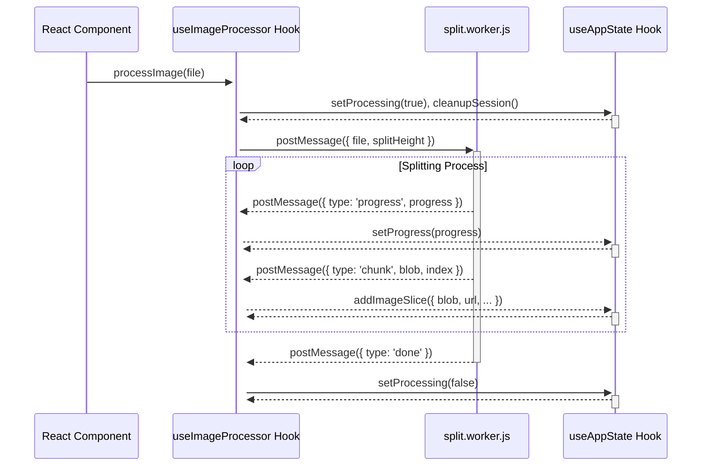

# 文档 05: 业务逻辑层 (Business Logic Layer)

## 1. 概述

本文档聚焦于 `screenshot-splitter` 应用的核心——业务逻辑层 (Business Logic Layer, BLL)。BLL 负责执行应用的核心功能和业务规则。在本应用中，核心业务逻辑就是**长截图的分割处理**。

该层的设计有两个主要目标：
1.  **准确性**: 确保图片能被精确地按照用户设定的高度进行分割。
2.  **性能**: 在处理大尺寸图片时，不能阻塞 UI 线程，必须为用户提供流畅的交互体验。

为了实现这些目标，业务逻辑层采用了一种**主线程-工作线程 (Main-Worker) 协作模式**，将计算密集型的任务完全委托给后台的 Web Worker 处理。

## 2. 架构图

业务逻辑的执行流程和数据流转可以用以下序列图来清晰地展示：


这个图生动地描绘了从用户发起操作到最终状态更新的完整异步流程。`useImageProcessor` Hook 扮演了**协调者 (Orchestrator)** 的角色，负责在 UI 组件、Web Worker 和应用状态之间传递消息和数据。

## 3. 代码示例

业务逻辑的核心位于 Web Worker 中，它负责实际的图片分割算法。

**文件路径**: `packages/screenshot-splitter/src/workers/split.worker.js`
```javascript
// (Simplified Algorithm)
async function processImage(file, splitHeight) {
  // 1. 高效解码图片
  const imageBitmap = await createImageBitmap(file);

  // 2. 在离屏 Canvas 上绘制原图
  const canvas = new OffscreenCanvas(imageBitmap.width, imageBitmap.height);
  const ctx = canvas.getContext('2d');
  ctx.drawImage(imageBitmap, 0, 0);
  imageBitmap.close(); // 释放内存

  // 3. 循环切割
  const totalChunks = Math.ceil(canvas.height / splitHeight);
  for (let i = 0; i < totalChunks; i++) {
    const startY = i * splitHeight;
    const chunkHeight = Math.min(splitHeight, canvas.height - startY);

    // 4. 创建切片 Canvas 并复制图像区域
    const chunkCanvas = new OffscreenCanvas(canvas.width, chunkHeight);
    const chunkCtx = chunkCanvas.getContext('2d');
    chunkCtx.drawImage(canvas, 0, startY, canvas.width, chunkHeight, 0, 0, canvas.width, chunkHeight);

    // 5. 转换为 Blob 并发送回主线程
    const blob = await chunkCanvas.convertToBlob({ type: 'image/jpeg', quality: 0.9 });
    self.postMessage({ type: 'chunk', blob, index: i });
    
    // 6. 上报进度
    const progress = Math.round(25 + ((i + 1) / totalChunks) * 70);
    self.postMessage({ type: 'progress', progress });
  }

  self.postMessage({ type: 'done' });
}
```
这段代码展示了现代浏览器 API (`createImageBitmap`, `OffscreenCanvas`) 在实现高性能图像处理方面的强大能力。整个过程不涉及 DOM 操作，因此可以在后台线程中高效执行。

## 4. 配置示例

业务逻辑的触发和回调处理则由 `useImageProcessor` Hook 进行配置和管理。

**文件路径**: `packages/screenshot-splitter/src/hooks/useImageProcessor.ts`
```typescript
// (Simplified Hook Setup)
export function useImageProcessor({ actions }) {
  // 定义当 Worker 发回数据时的回调函数
  const handleChunk = useCallback((blob, index) => {
    const url = URL.createObjectURL(blob);
    const img = new Image();
    img.onload = () => {
      // 当图片加载后，将切片信息更新到应用状态中
      actions.addImageSlice({
        blob,
        url,
        index,
        width: img.naturalWidth,
        height: img.naturalHeight,
      });
    };
    img.src = url;
  }, [actions]);

  const { createWorker, startProcessing } = useWorker({
    onChunk: handleChunk, // 将回调函数 "配置" 给 Worker 处理器
    // ... onProgress, onDone, onError
  });

  const processImage = useCallback(async (file) => {
    createWorker();
    startProcessing(file, state.splitHeight);
  }, [/*...*/]);

  return { processImage, progress };
}
```
这里，`useImageProcessor` hook 像一个配置中心，它定义了如何处理来自业务逻辑层（Worker）的各种事件，并将这些处理逻辑与应用的状态管理层 `actions` 连接起来。这种清晰的职责划分使得代码非常易于理解和维护。

## 5. 最佳实践

*   **业务逻辑应与UI分离**: 核心业务逻辑（如此处的分割算法）应保持纯粹，不应依赖任何 React 组件或 DOM 元素。将其放在 Web Worker 中是实现这种分离的绝佳方式。
*   **明确的通信协议**: 主线程和 Worker 之间的消息传递应该有一个明确、版本化的“协议”（如代码注释中所示）。使用 `{ type, payload }` 的格式能让消息处理更具可预测性。
*   **健壮的错误处理**: 业务逻辑的每个环节都应考虑可能出现的错误（如文件格式不支持、解码失败），并通过 `try...catch` 捕获，再通过错误消息通道报告给主线程，以便 UI 能友好地提示用户。
*   **资源管理**: 在 Worker 中，应及时释放不再需要的资源，例如调用 `imageBitmap.close()`，以减少内存占用，特别是在处理非常大的图像时。

## 6. 案例分析

**场景**: 用户上传了一张 50000 x 2000 像素的超大截图，并希望将其按 1200 像素的高度分割。

这个极限场景能很好地体现当前业务逻辑层设计的优势：
1.  **UI 保持响应**: 用户点击“开始处理”后，尽管后台正在进行大量的计算，但 UI 线程完全不受影响。用户仍然可以滚动页面、点击其他按钮，甚至切换到其他浏览器标签页。
2.  **内存效率**: 使用 `createImageBitmap` 和 `OffscreenCanvas` 比传统的 `` 标签和主线程 `Canvas` 内存效率更高。同时，分割过程是逐块处理的，一次只在内存中保留一个小的切片 `chunkCanvas`，避免了因一次性加载超大图像而可能导致的浏览器崩溃。
3.  **清晰的进度反馈**: 循环中的 `postMessage({ type: 'progress', ... })` 调用会持续向主线程报告进度。UI 层可以根据这个进度更新一个进度条，让用户明确知道处理过程没有卡死，并对剩余时间有一个大致的预期。

如果没有采用 Web Worker 模式，这样的操作几乎肯定会导致浏览器页面卡死数秒甚至数十秒，从而带来极差的用户体验。
