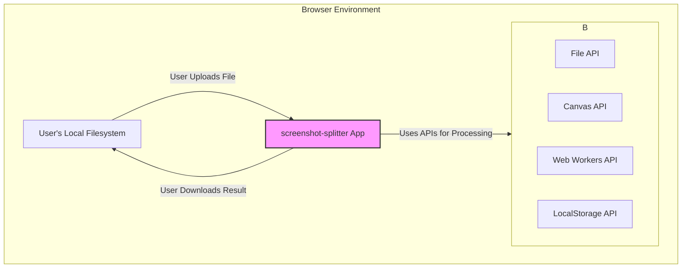

# 文档 07: API 架构 (API Architecture)

## 1. 概述

本文档旨在分析 `screenshot-splitter` 应用的 API 架构。API (Application Programming Interface) 架构通常指前端应用如何与后端服务器或其他外部服务进行通信的模式和协议。

经过对代码库的全面分析，结论是：**本项目是一个纯客户端应用，不涉及任何传统意义上的后端 API 调用。**

这意味着：
*   应用的所有功能都在用户的浏览器中独立完成。
*   不依赖任何外部服务器来处理核心业务逻辑（如图片分割）。
*   用户的数据（上传的图片）不会离开其本地计算机。

这种架构选择是基于该工具的核心价值——**隐私、安全和离线可用性**。

## 2. 架构图

由于不存在外部 API 通信，传统的客户端-服务器架构图不适用于此项目。取而代之，我们可以用一个“系统边界图”来描述其架构，清晰地展示应用与外部世界的交互方式。


该图表明，应用的“API”实际上是**浏览器自身提供的 Web API**。它通过 `File API` 读取用户输入，利用 `Web Workers` 和 `Canvas API` 进行处理，并通过 `LocalStorage` 进行状态持久化，最终允许用户将结果保存回本地文件系统。所有交互都限制在浏览器这个沙箱环境中。

## 3. 代码示例

代码中没有任何网络请求库（如 `fetch`, `axios`）的踪迹。相反，与“外部世界”（即用户文件系统）的交互是通过浏览器事件和 API 完成的。

**文件读取 (输入)**:
**文件路径**: `packages/screenshot-splitter/src/components/FileUploader.tsx` (Conceptual)
```typescript
const FileUploader = ({ onFileSelect }) => {
  const handleFileChange = (event: React.ChangeEvent<HTMLInputElement>) => {
    const file = event.target.files?.[0];
    if (file) {
      // 通过回调将本地 File 对象传递给业务逻辑层
      // 这里没有网络上传，只是在内存中传递引用
      onFileSelect(file);
    }
  };

  return <input type="file" onChange={handleFileChange} />;
}
```

**文件保存 (输出)**:
**文件路径**: `packages/screenshot-splitter/src/utils/zipExporter.ts` (Conceptual)
```typescript
import { saveAs } from 'file-saver'; // A utility to save files on the client-side

export async function exportToZIP(slices, selectedSlices, filename) {
  const zip = new JSZip();
  
  // ... (logic to add selected slices to the zip object) ...

  const zipBlob = await zip.generateAsync({ type: 'blob' });

  // 使用 file-saver 触发浏览器下载，将 Blob 保存到本地
  // 同样，这里也没有网络请求
  saveAs(zipBlob, filename);
}
```
这两个例子清晰地展示了应用的 I/O 操作是如何通过浏览器 API 和客户端库在本地完成的。

## 4. 配置示例

本项目没有 API 相关的配置文件，例如 `.env` 文件中通常会包含的 `API_BASE_URL` 或 `API_KEY` 等变量。

```bash
# .env file (example of what is NOT present)

# REACT_APP_API_URL=https://api.example.com/v1
# REACT_APP_API_KEY=your_secret_key
```
这种配置的**缺失**本身就是该架构的一个重要特征，它向开发者明确传达了这是一个自包含的、无需后端配置的客户端应用。

## 5. 最佳实践

*   **明确系统边界**: 对于纯客户端应用，在项目文档（如此文档）中明确声明其无后端依赖的特性至关重要。这有助于新成员快速理解项目范围，并避免在错误的方向上寻找 API 配置。
*   **利用现代浏览器API**: 充分利用 `Web Workers`, `File System Access API` (在支持的浏览器中), `IndexedDB` 等现代浏览器 API，可以在不依赖服务器的情况下，构建功能强大且性能卓越的离线应用。
*   **隐私优先**: 在项目文档和 UI 中向用户强调其数据不会被上传到任何服务器。这对于处理用户敏感数据（如个人截图）的应用来说，是一个重要的信任建立点和核心卖点。
*   **客户端库的选择**: 谨慎选择用于处理文件（如 `jszip`, `jspdf`）的客户端库。优先选择那些体积小、性能好、社区活跃且不含隐藏的网络请求的库。

## 6. 案例分析

**场景**: 一位用户需要在没有网络连接的飞机上，处理一张包含敏感商业信息的长截图。

当前架构完美地满足了这一需求：
1.  **离线可用**: 由于应用是一个缓存了的 `SPA`，用户可以在完全离线的环境中打开并使用它。
2.  **数据安全**: 用户选择的截图文件从始至终都只存在于他自己的设备内存和浏览器沙箱中。没有任何数据包通过网络发送，从而杜绝了数据在传输过程中被截获的风险。
3.  **功能完整**: 所有的图片分割、预览和打包下载功能都依赖于浏览器内置的 API，因此在离线状态下功能完全不受影响。

这个案例凸显了纯客户端架构在特定应用场景下的巨大优势。对于那些功能明确、计算密集型且高度关注用户隐私的工具类应用，这是一种非常理想的架构模式。
