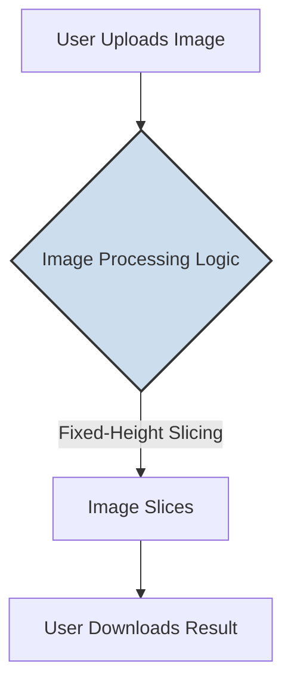

# 文档 09: AI 服务集成 (AI Services Integration)

## 1. 概述

本文档旨在分析 `screenshot-splitter` 项目中人工智能（AI）服务的集成情况。这包括对外部 AI API（如 OpenAI, Google Gemini）的调用，以及在客户端使用 AI 模型（如 TensorFlow.js）的审查。

经过对项目代码库和依赖项的彻底审查，得出的结论是：**本项目目前没有集成任何 AI 服务或模型。**

该应用的核心功能——长截图分割，是基于**确定性算法 (Deterministic Algorithm)** 实现的，而非 AI 或机器学习模型。

## 2. 架构图

由于不存在 AI 服务集成，因此没有相关的架构图。我们可以通过一个“功能实现方式”图来对比本项目与一个假设的 AI 驱动型应用的差异。

**本项目 (算法驱动)**


**假设的应用 (AI 驱动)**
```mermaid
graph TD
    subgraph Client-Side
        A[User Uploads Image] --> B_Client[Client-Side Pre-processing];
    end
    
    subgraph Cloud Service
        AI[AI Model (e.g., Content-Aware Splitting)];
    end

    B_Client -- "Sends Image Data" --> AI;
    AI -- "Returns Split Points" --> B_Client;
    
    B_Client -- "Slices Image Based on AI Result" --> C_Client[Image Slices];
    C_Client --> D_Client[User Downloads Result];

    style AI fill:#fcd,stroke:#333,stroke-width:2px
```
对比可见，本项目的逻辑是自包含的、可预测的。而一个 AI 驱动的应用则会依赖外部服务，其分割结果可能会根据图片内容动态变化。

## 3. 代码示例

项目代码中不包含任何与 AI 服务交互的 SDK 或 API 调用。图片分割的核心逻辑位于 `split.worker.js` 中，它是一个纯粹的几何计算过程。

**文件路径**: `packages/screenshot-splitter/src/workers/split.worker.js`
```javascript
// (Core slicing logic)
const totalChunks = Math.ceil(canvas.height / splitHeight); // <--
for (let i = 0; i < totalChunks; i++) {
  const startY = i * splitHeight; // <--
  const chunkHeight = Math.min(splitHeight, canvas.height - startY); // <--

  // ... (drawImage based on calculated startY and chunkHeight) ...
}
```
代码中的高亮行清楚地表明，分割的依据是用户提供的 `splitHeight` 和图片的几何尺寸，这是一个固定的数学计算，不涉及任何智能分析或内容识别。

## 4. 配置示例

项目中没有任何与 AI 服务相关的配置。例如，在环境变量 (`.env`) 或其他配置文件中，不存在类似以下的 API 密钥或服务终端节点：

```bash
# .env file (example of what is NOT present)

# OPENAI_API_KEY="sk-..."
# GOOGLE_AI_STUDIO_API_KEY="..."
# AI_SERVICE_ENDPOINT="https://api.ai-provider.com/v1/smart-split"
```
这种配置的缺失进一步证实了该应用不依赖外部 AI 服务。

## 5. 最佳实践 (针对未来可能的集成)

尽管当前没有集成 AI 服务，但如果未来有此计划（例如，实现“智能内容识别分割”），可以遵循以下最佳实践：

*   **分离 AI 逻辑**: 应将所有与 AI 服务交互的逻辑封装在一个独立的模块或自定义 Hook 中（例如 `useAISplitter.ts`）。这使得 AI 功能可以作为可选模块，易于管理和替换。
*   **保护 API 密钥**: API 密钥绝不能硬编码在前端代码中。它们应该通过服务器端代理或安全的后端函数（如 Serverless Functions）来调用，以防止密钥泄露。
*   **提供明确的用户反馈**: AI 处理可能需要时间。在调用 AI 服务时，必须向用户提供清晰的加载和处理状态指示。
*   **优雅降级**: 如果 AI 服务调用失败或不可用，应用应能优雅地降级（Fallback）到现有的基于算法的分割模式，而不是完全瘫痪。
*   **成本和使用监控**: AI API 调用通常是收费的。需要在服务端或通过服务提供商的仪表盘建立监控，以跟踪使用量和成本。

## 6. 案例分析

**场景**: 考虑为应用增加一个新功能：“智能识别对话气泡并分割”。

这个功能显然需要 AI 的能力。基于当前架构，集成这个功能的可能路径是：
1.  **选择 AI 服务**: 选择一个提供视觉内容分析的云服务。
2.  **创建后端代理**: 建立一个简单的后端服务（例如，使用 Vercel Functions 或 Cloudflare Workers）。这个服务将接收来自前端的图片，并安全地使用服务器端的 API 密钥调用 AI 服务。
3.  **开发新的 Hook**: 在前端创建一个 `useSmartSplitter` Hook。这个 Hook 将负责：
    *   调用后端代理 API。
    *   处理加载状态。
    *   接收从 AI 返回的分割点坐标。
4.  **更新 UI**: 在 UI 中添加一个“智能分割”的选项。当用户选择此选项时，`App.tsx` 会调用 `useSmartSplitter` hook 而不是现有的 `useImageProcessor` hook。
5.  **结果处理**: `useSmartSplitter` hook 在获取到分割点后，可以将这些信息传递给现有的 Web Worker，让 Worker 根据这些动态坐标来执行 `drawImage` 操作。

这个案例说明，尽管当前没有 AI 集成，但现有的解耦架构（特别是 Hooks 和 Web Workers 的使用）为未来平滑地引入此类高级功能提供了良好的基础。
