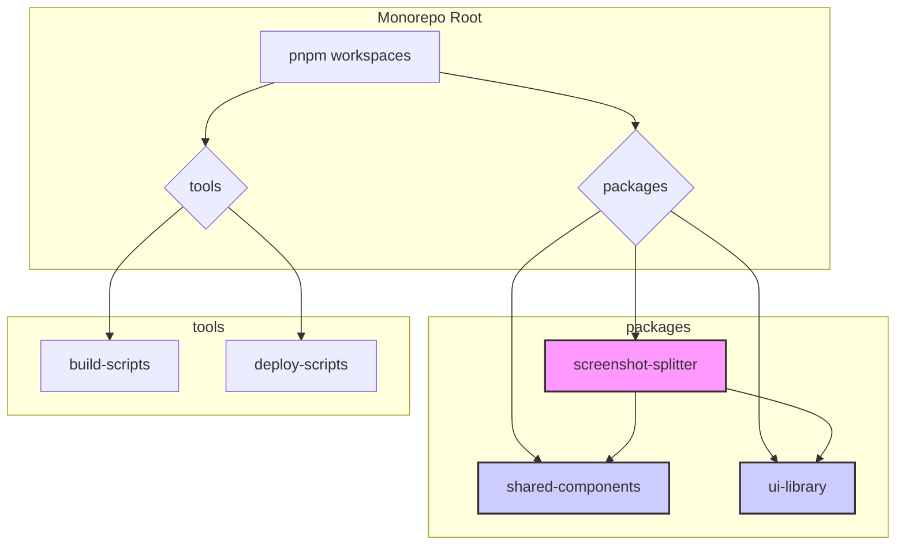

# 文档 01: 项目概述 (Project Overview)

## 1. 概述

本文档旨在对 `dual-build-monorepo-system` 项目进行宏观概述。该项目的核心是一个基于 pnpm workspaces 管理的 Monorepo 系统，其主要目标是高效地开发、管理和构建多个相互关联的前端包。

目前，该系统内托管了一个名为 **长截图分割工具 (`screenshot-splitter`)** 的核心应用，同时还包含了两个共享库：`shared-components` 和 `ui-library`，旨在实现代码复用和统一的 UI/UX 体验。

该项目的一个显著特点是其**双模式构建系统**，允许核心应用 `screenshot-splitter` 被构建为**单页应用 (SPA)** 或**单一 HTML 文件 (Single File)**，以适应不同的部署需求。

## 2. 架构图

项目的整体架构可以通过以下图表来可视化，它展示了各个包之间的依赖关系以及共享的开发工具链。



*   **pnpm workspaces**: 作为 Monorepo 的管理核心，负责处理所有包的依赖安装和脚本执行。
*   **packages**: 包含项目的所有可发布模块。
    *   `screenshot-splitter`: 核心业务应用。
    *   `shared-components` & `ui-library`: 为 `screenshot-splitter` 提供可复用的组件和UI元素。
*   **tools**: 存放用于支持整个项目开发、构建和部署的自定义脚本。

## 3. 代码示例

Monorepo 的核心是 `pnpm-workspace.yaml` 文件，它定义了哪些目录下的包会被 pnpm 管理。

**文件路径**: `pnpm-workspace.yaml`
```yaml
packages:
  - 'packages/*'
  - 'apps/*'
  - 'tools/*'
```
这段配置告诉 pnpm，所有位于 `packages/`、`apps/` 和 `tools/` 目录下的子目录都被视为项目的一部分。这种简洁的声明方式是 pnpm workspaces 的强大之处，它使得添加和管理新的包变得非常容易。

## 4. 配置示例

项目的根 `package.json` 文件中定义了一系列脚本，用于协调所有包的生命周期。

**文件路径**: `package.json`
```json
{
  "scripts": {
    "dev": "node tools/build-scripts/dev-server.js",
    "build": "node tools/build-scripts/build-manager.js build",
    "lint": "eslint . --ext .ts,.tsx,.js,.jsx",
    "test": "pnpm --filter \"./packages/*\" test",
    "clean": "pnpm --filter \"./packages/*\" clean && rm -rf dist"
  }
}
```
*   `dev`: 启动一个统一的开发服务器，可以同时为多个包提供服务。
*   `build`: 调用自定义的构建管理器脚本，可以按需构建一个或多个包。
*   `lint` & `test`: 使用 `pnpm --filter` 命令，可以在所有包上并行执行 linting 和测试，极大地提高了开发效率。

## 5. 最佳实践

*   **依赖管理**: 尽量将共享的开发依赖（如 `typescript`, `eslint`, `prettier`）提升到根 `package.json` 中，以保证所有包使用统一的版本，避免版本冲突。
*   **原子化提交**: 在修改涉及多个包的功能时，尽量保证提交的原子性，即一次提交包含一个完整的功能改动，避免破坏主分支的稳定性。
*   **包间引用**: 始终使用工作区协议 `workspace:*` 来引用内部包，例如 `screenshot-splitter` 引用 `shared-components` 时，其 `package.json` 中应声明 `"shared-components": "workspace:^1.0.0"`。这能确保 pnpm 总是链接到工作区内的最新代码。
*   **自定义脚本**: 充分利用 `tools` 目录来沉淀可复用的工具脚本，避免在各个包中重复编写相同的逻辑。

## 6. 案例分析

**场景**: 开发“长截图分割工具” `screenshot-splitter`。

在这个项目中，`screenshot-splitter` 应用需要一个文件上传组件和一个图片预览组件。通过 Monorepo 架构，我们可以这样做：

1.  **UI 库**: 在 `ui-library` 中开发一个通用的 `Button` 组件和一个 `Uploader` 组件，并发布。
2.  **共享组件**: 在 `shared-components` 中，基于 `ui-library` 的基础组件，组合开发一个业务相关的 `ImagePreviewer` 组件。
3.  **核心应用**: 在 `screenshot-splitter` 中，直接通过 `import { ImagePreviewer } from 'shared-components'` 来使用共享组件，而无需关心其内部实现。

这种方式带来了诸多好处：
*   **高内聚，低耦合**: 每个包都只关注自己的核心职责。
*   **代码复用**: `ui-library` 和 `shared-components` 可以被未来的其他应用复用。
*   **开发效率**: 不同团队可以并行开发不同的包，只要接口约定清晰。
