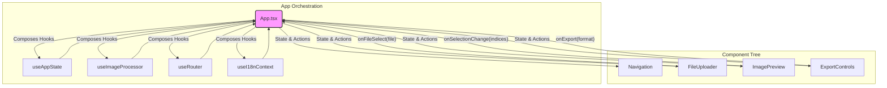

# 文档 06: 表现层架构 (Presentation Layer Architecture)

## 1. 概述

本文档剖析了 `screenshot-splitter` 应用的表现层（Presentation Layer）架构。表现层是用户直接与之交互的部分，其核心职责是渲染用户界面（UI）、响应用户输入，并以直观的方式展示应用状态。

本项目表现层遵循了现代 React 的最佳实践，采用了**容器与展示组件分离 (Container/Presentational Pattern)** 的思想，并通过组合自定义 Hooks 来实现逻辑和状态的注入。

其架构核心原则是：
*   **状态驱动UI (State-Driven UI)**: 界面是应用状态的直接映射。
*   **单向数据流 (Unidirectional Data Flow)**: 状态和逻辑自顶向下传递，事件自底向上传递。
*   **组件化与可复用性**: 将 UI 拆分为独立的、可复用的组件。

## 2. 架构图

表现层的组件层级和数据流可以用以下图表来表示：


该图清晰地展示了 `App.tsx` 如何作为“大脑”，通过组合各种 Hooks 来获取状态和能力，然后将这些状态（数据）和动作（回调函数）作为 props 注入到下层的“哑”组件中。当用户在哑组件上进行操作时，会调用这些回调函数，从而触发“大脑”中的状态更新，形成一个完整的、可预测的数据流闭环。

## 3. 代码示例

`App.tsx` 是表现层架构的核心，它完美地展示了 Hooks 组合模式。

**文件路径**: `packages/screenshot-splitter/src/App.tsx`
```typescript
// (Simplified App component structure)
function AppContent() {
  // 1. 组合 Hooks，获取所有状态和逻辑
  const { state, actions } = useAppState();
  const { processImage, progress } = useImageProcessor({ state, actions });
  const { currentPath, push } = useRouter();
  const { t } = useI18nContext();

  // 2. 定义事件处理器，连接UI操作和业务逻辑
  const handleFileSelect = async (file: File) => {
    await processImage(file);
    push('/split'); // 处理完成后导航
  };
  
  // 3. 根据路由和状态，渲染不同的展示组件
  const renderContent = () => {
    switch (currentPath) {
      case '/upload':
        return <FileUploader onFileSelect={handleFileSelect} progress={progress} />;
      case '/split':
        return <ImagePreview slices={state.imageSlices} ... />;
      // ... other cases
    }
  };

  return (
    <div>
      <Navigation onNavigate={push} ... />
      <main>{renderContent()}</main>
    </div>
  );
}
```
这段代码体现了表现层的职责分离：
*   **Hooks**: 提供状态和无UI的逻辑。
*   `AppContent`: 作为**协调者**，连接 Hooks 和展示组件。
*   `FileUploader`, `ImagePreview`: 作为**展示者**，只负责渲染UI和发出事件。

## 4. 配置示例

一个典型的“哑”组件，如 `FileUploader`，其接口（props）被设计得非常通用，不包含任何业务逻辑。

**文件路径**: `packages/screenshot-splitter/src/components/FileUploader.tsx` (Conceptual)
```typescript
interface FileUploaderProps {
  onFileSelect: (file: File) => void;
  isProcessing: boolean;
  progress: number;
}

export const FileUploader: React.FC<FileUploaderProps> = ({
  onFileSelect,
  isProcessing,
  progress
}) => {
  const handleDrop = (event) => {
    const file = event.dataTransfer.files[0];
    if (file) {
      onFileSelect(file); // 调用从父组件传入的回调
    }
  };

  return (
    <div>
      {/* 当 isProcessing 为 true 时，显示进度条 */}
      {isProcessing ? (
        <ProgressBar percentage={progress} />
      ) : (
        <div onDrop={handleDrop}>Drop file here</div>
      )}
    </div>
  );
};
```
`FileUploader` 完全由其 props 控制。它不知道文件被选中后会发生什么，也不知道进度条的数据从何而来。这种设计使得它非常容易被复用和测试。

## 5. 最佳实践

*   **保持展示组件的纯粹**: 展示组件应尽量是纯函数，即给定相同的 props，总是渲染相同的输出。避免在其中包含业务逻辑、数据请求或复杂的状态。
*   **将逻辑提升到 Hooks**: 任何可复用的、与UI无关的逻辑（如数据请求、格式化、复杂的计算）都应该被抽取到自定义 Hooks 中。这使得逻辑本身可以被独立测试，也让组件代码更简洁。
*   **使用 Context 进行依赖注入**: 对于需要在组件树深层共享的数据（如国际化 `t` 函数、主题信息），使用 React Context 是一种比 props drilling（层层传递props）更优雅的解决方案。本项目中的 `I18nProvider` 就是一个很好的例子。
*   **合理的组件粒度**: 组件不宜过大。当一个组件变得过于复杂时，应考虑将其拆分为更小的、职责更单一的子组件。`ScreenshotSplitter.tsx` 就是一个将多个小组件 (`FileUploader`, `ImagePreview`, `ExportControls`) 组合成一个功能单元的范例。

## 6. 案例分析

**场景**: 需要在 `ImagePreview` 组件的每个图片切片右上角添加一个“删除”按钮，允许用户删除单个切片。

基于当前的表现层架构，实现这个需求的步骤清晰且低风险：
1.  **数据层/业务层**: 在 `appStateReducer` 中增加一个 `DELETE_SLICE` action，用于从 `imageSlices` 数组中移除一个切片。在 `useAppState` hook 中暴露对应的 `deleteSlice(index)` 动作函数。
2.  **修改展示组件**: 在 `ImagePreview` 组件中，为每个切片渲染一个删除按钮。给这个按钮的 `onClick` 事件绑定一个新的 prop，例如 `onDeleteSlice(index)`。
3.  **连接**: 在 `App.tsx` 中，将从 `useAppState` 得到的 `actions.deleteSlice` 函数传递给 `ImagePreview` 的 `onDeleteSlice` prop。
    ```typescript
    // In App.tsx
    <ImagePreview 
      slices={state.imageSlices} 
      onDeleteSlice={actions.deleteSlice} // 连接动作
      ...
    />
    ```

整个过程没有修改 `ImagePreview` 的内部逻辑，只是为其增加了一个新的回调 prop。数据流依然是单向的，状态管理也集中在 `useAppState` 中。这充分体现了该架构在需求变更时的**可维护性和扩展性**。
