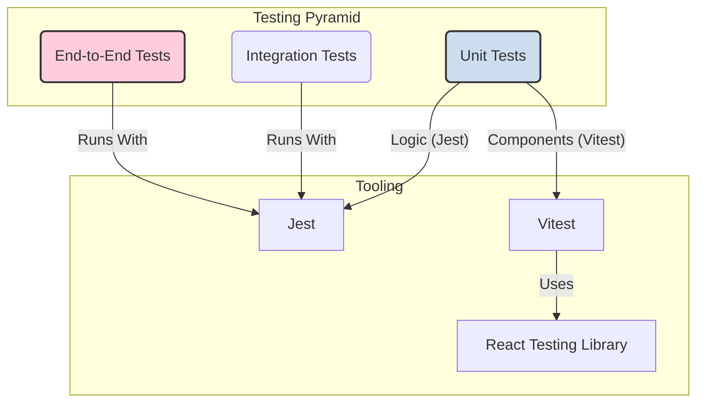

# 文档 11: 测试架构 (Testing Architecture)

## 1. 概述

本文档阐述了 `dual-build-monorepo-system` 项目的测试架构和策略。一个健全的测试策略是保证软件质量、提升开发信心和支持长期迭代的关键。本项目采用了一种分层、全面的测试方法，覆盖了从单个函数到完整部署流程的各个环节。

该测试架构遵循“测试金字塔”模型，主要包括三个层次：
1.  **单元测试 (Unit Tests)**: 验证最小代码单元（函数、组件）的正确性。
2.  **集成测试 (Integration Tests)**: 确保多个单元协同工作时不出问题。
3.  **端到端测试 (End-to-End Tests)**: 从用户或系统角度出发，验证整个应用或流程的正确性。

项目采用了 **Vitest** 和 **Jest** 双测试框架的策略，以兼顾开发体验和功能全面性。

## 2. 架构图

测试金字塔和所用工具的分布可以用下图来表示：


该图清晰地展示了：
*   **单元测试**是基础，数量最多，覆盖了UI组件（使用 Vitest + RTL）和纯逻辑（使用 Jest）。
*   **集成测试和 E2E 测试**数量较少，位于金字塔上层，由 Jest 统一执行。
*   **React Testing Library (RTL)** 是测试 React 组件的首选库，它鼓励开发者编写更贴近用户行为的测试。

## 3. 代码示例

**组件单元测试 (使用 Vitest + RTL)**:
这类测试关注组件的渲染输出和用户交互。

**文件路径**: `packages/screenshot-splitter/src/components/DebugInfoControl.test.tsx`
```typescript
import { describe, it, expect, vi } from 'vitest';
import { render, screen, fireEvent } from '@testing-library/react';
import DebugInfoControl from './DebugInfoControl';

describe('DebugInfoControl', () => {
  it('应该在点击关闭按钮时调用onVisibilityChange', () => {
    // 1. Arrange: 准备一个 mock 函数和 props
    const mockOnVisibilityChange = vi.fn();
    render(<DebugInfoControl visible={true} onVisibilityChange={mockOnVisibilityChange} />);

    // 2. Act: 模拟用户点击关闭按钮
    const closeButton = screen.getByTitle('隐藏控制面板');
    fireEvent.click(closeButton);

    // 3. Assert: 断言 mock 函数被以正确的参数调用
    expect(mockOnVisibilityChange).toHaveBeenCalledWith(false);
  });
});
```

**逻辑单元测试 (使用 Jest)**:
这类测试不涉及 UI，只关注输入和输出。

**文件路径**: `packages/shared-components/src/managers/__tests__/SharedStateManager.test.ts`
```javascript
import { SharedStateManager } from '../SharedStateManager';

describe('SharedStateManager', () => {
  let manager: SharedStateManager;

  beforeEach(() => {
    manager = new SharedStateManager();
  });

  test('应该能够设置和获取状态', () => {
    // 1. Arrange & 2. Act
    manager.set('user', { name: 'Test User' });
    const retrievedState = manager.get('user');
    
    // 3. Assert
    expect(retrievedState).toEqual({ name: 'Test User' });
  });
});
```

## 4. 配置示例

项目的测试策略通过根 `package.json` 中的脚本进行协调。

**文件路径**: `package.json`
```json
{
  "scripts": {
    "test": "pnpm --filter \"./packages/*\" test",
    "test:unit": "jest --selectProjects screenshot-splitter shared-components",
    "test:integration": "jest --selectProjects build-scripts",
    "test:e2e": "jest tests/e2e",
    "test:coverage": "jest --coverage",
    "test:ci": "jest --ci --coverage --watchAll=false"
  }
}
```
*   `test`: 一个便捷脚本，运行所有包内的测试。
*   `test:unit`, `test:integration`, `test:e2e`: 分别运行不同类型的测试，便于在 CI/CD 流水线中分阶段执行。Jest 的 `selectProjects` 功能在 Monorepo 环境中非常有用。
*   `test:coverage`: 生成测试覆盖率报告，是衡量测试完备性的重要指标。

## 5. 最佳实践

*   **测试应与实现细节解耦**: 使用 React Testing Library 的理念，优先通过用户可见的文本、角色（role）和标签来查询元素，而不是通过 CSS 类名或内部 state。这使得测试在代码重构时更加健壮。
*   **单元测试应快速且独立**: 每个单元测试都应该可以独立运行，不依赖于其他测试。避免在测试之间共享状态。`beforeEach` 钩子是实现测试隔离的常用工具。
*   **模拟（Mock）外部依赖**: 在单元测试中，应模拟所有外部依赖（如 API 调用、自定义 Hooks），以确保只测试当前单元的逻辑。`vi.mock` 和 `jest.mock` 是实现这一点的标准方法。
*   **E2E 测试应关注关键用户流程**: E2E 测试运行成本高，应专注于覆盖最关键的用户工作流，例如“成功上传-分割-下载”的完整流程，而不是测试每一个 UI 细节。

## 6. 案例分析

**场景**: 一位开发者重构了 `DebugInfoControl` 组件的内部 HTML 结构，将 `<div>` 换成了 `<section>`，并修改了 CSS 类名，但组件对外的功能和可见文本没有改变。

由于测试遵循了最佳实践，结果如下：
1.  **测试通过**: `DebugInfoControl.test.tsx` 中的测试用例依然能够通过 `screen.getByTitle(...)` 和 `screen.getByText(...)` 找到元素并模拟交互，因为这些查询不依赖于具体的 HTML 标签或 CSS 类。
2.  **信心保证**: 开发者可以充满信心地提交这次重构，因为测试通过证明了重构没有破坏组件对用户的功能承诺。

这个案例说明，一个良好的测试架构不仅能发现 bug，还能**促进安全的重构**，是保障项目长期健康发展的基石。特别是，项目的**构建过程 E2E 测试**是一个亮点，它超越了常规的 UI 测试，确保了开发工具链本身的稳定性。
