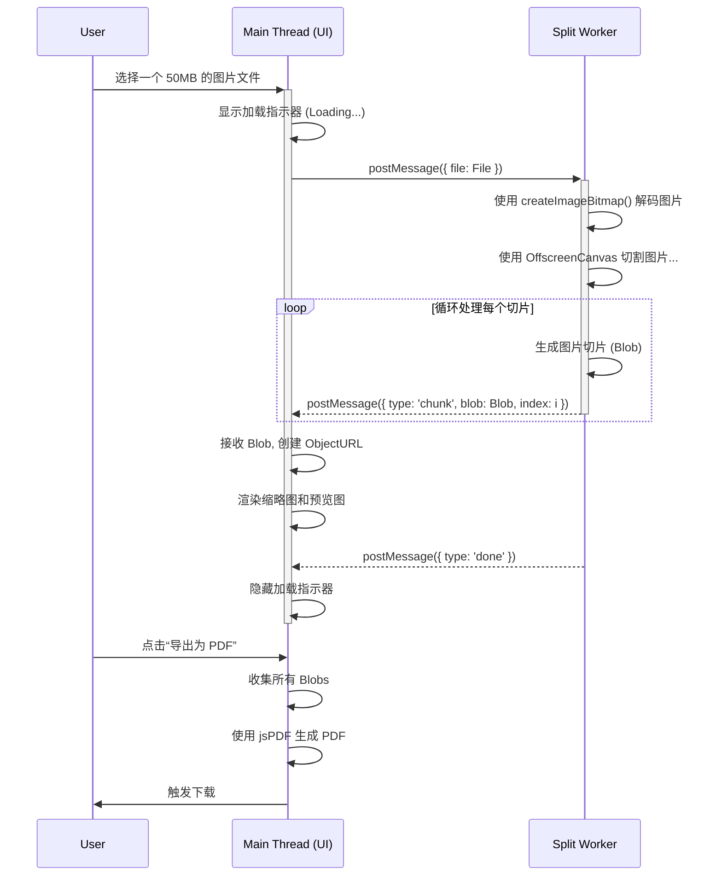

# 技术栈文档 (Tech Stack)

**版本:** 2.0.0
**日期:** 2025-07-19

---

## 1. 概述

本文档旨在为《产品需求文档》v2.0.0 中定义的功能升级提供技术实现方案。核心挑战在于如何**在浏览器端高效、稳定地处理高达 50MB 的大尺寸图片**，并构建一个流畅的、响应式的预览界面，同时保证用户体验。

我们将保留项目轻量、无后端的特性，现有核心库（`JSZip.js`, `jsPDF.js`）将被继续使用，但核心处理逻辑需要进行架构性调整。

## 2. 核心技术方案与调整

### 2.1. 引入 Web Workers 进行异步处理

这是本次技术升级的**核心决策**。直接在主线程中解码和切割 50MB 的图片几乎必然会导致 UI 线程长时间冻结，甚至使浏览器标签页崩溃。

-   **目的:** 将计算密集型任务（图片解码、Canvas 绘制与切割）从主线程中剥离，确保 UI 的流畅响应。
-   **实现:**
    1.  创建一个独立的 `split-worker.js` 脚本文件。
    2.  当用户上传图片后，主线程将 `File` 对象直接传递给 Web Worker。
    3.  所有的图片加载、绘制到 Canvas 以及切割操作，都将在 Worker 线程中完成。
    4.  主线程通过监听来自 Worker 的消息来更新 UI（如进度条、生成预览图、完成提示等）。

### 2.2. 采用 OffscreenCanvas 与 高效数据传输

为了最大化性能，我们将在 Web Worker 内部使用 `OffscreenCanvas`。

-   **目的:** `OffscreenCanvas` 是一个可以在 Worker 中使用的 Canvas 对象，它不与 DOM 绑定，因此渲染操作更快，能有效避免在主线程和 Worker 之间来回传递大量的图像数据。
-   **实现:**
    1.  在 Worker 中，使用 `createImageBitmap()` 来从 `File` 对象中高效地解码出位图。
    2.  将位图绘制到 `OffscreenCanvas` 上。
    3.  循环切割 `OffscreenCanvas` 上的内容，并将每个切片转换为 `Blob` 对象。
    4.  **数据传输:** 将生成的 `Blob` 对象通过 `postMessage()` 从 Worker 发送回主线程。主线程接收到 `Blob` 后，使用 `URL.createObjectURL()` 来生成临时的 URL，用于在 `` 标签中显示缩略图和预览图。

### 2.3. 前端技术栈保持不变

现有技术栈完全满足新的 UI 布局需求。

-   **UI 框架:** 继续使用 **Tailwind CSS**。它的功能类（Utility Classes）能够快速、轻松地构建出响应式的双栏预览布局。
-   **核心库:**
    -   **`JSZip.js` & `jsPDF.js`:** 导出功能保持不变。主线程在接收到所有由 Worker 生成的图片 `Blob` 之后，再调用这两个库来生成 ZIP 或 PDF 文件。
    -   **`FileSaver.js`:** 继续用于触发浏览器下载。

## 3. 技术实现流程概览

## 4. 风险与缓解措施

-   **风险点:** 浏览器兼容性，主要是 `OffscreenCanvas`。
-   **缓解措施:** `Web Workers` 已被所有现代浏览器广泛支持。`OffscreenCanvas` 在 Chrome, Firefox, Edge, Safari (16.4+) 中也已得到支持。我们可以将这些浏览器版本作为项目的目标环境，并在文档中明确指出。对于不支持的旧版浏览器，可以考虑禁用相关功能并给出提示。

-   **风险点:** 主线程与 Worker 之间的通信管理可能变得复杂。
-   **缓解措施:** 设计一套清晰、简洁的消息传递协议。例如，定义 `{ type: 'PROGRESS', 'PERCENTAGE' }`, `{ type: 'CHUNK_RESULT', 'DATA' }`, `{ type: 'DONE' }`, `{ type: 'ERROR', 'MESSAGE' }` 等消息类型，使状态管理和调试更加容易。 